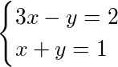
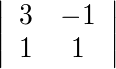
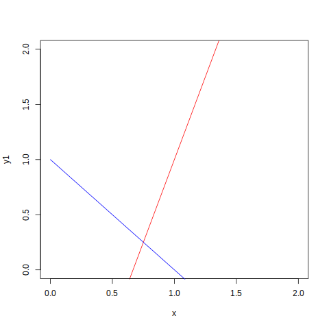
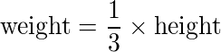
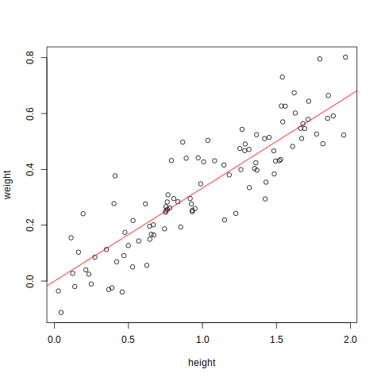

Linear Algebra Review - Miscellaneous Topics
============================================

- Keith Hughitt
- July 07, 2016

Relationship between coefficient matrices and empirical data matrices
---------------------------------------------------------------------

In the [Lay book](http://www.laylinalgebra.com/), many of the topics are
introduced in the context of systems of linear equations, where the matrix
represents the coefficients of variables for a set of _known_ equations.

For example:

<!--
\begin{cases} 
3x - y = 2 \\
x + y = 1
\end{cases}
-->



Coefficient matrix:

<!--
\left|\begin{array}
{cc} 3 & -1 \\ 1 & 1
\end{array}\right|
-->



When plotted, the result is two lines in R^2, intersecting at a single point:



```r
x <- 0:2
y1 <- 3*x - 2
y2 <- -x + 1

plot(x, y1, type='l', col='red', xlim=c(0,2), ylim=c(0,2))
lines(x, y2, col='blue')
```

- The point of intersection is the (single) solution to the system, here: (3/4, 1/4)
- The equations of the lines can be viewed as "constraints" on the systems.

Suppose that _x_ meant "height" and _y_ meant "weight", then the solution above
could represent a single observation of whatever thing we are measuring. Since
the lines intersect at only a single point, it is the only solution for this
system of equations, and therefor we cannot produce a population of
observations from these equations.

Now, suppose on the other hand, there is some process which generates
a population of observations whose height and weight are linearly related.

For example:



Which passes through our solution in the above system

Without knowing this relationship beforehand, we could collect a number of
observations of individuals from the population (our sample). If our
observations are not perfect, or the relationship is dependent on other
factors, then our observations will also include some noise componenet such
that the don't fall exactly no the line determined by our linear relationship.

```r
set.seed(1)
n <- 100

height <- sample(seq(0, 2, by=0.001), n)
weight <- (1/3) * height + rnorm(n, sd=0.1)
```

The first five entries in our _data_ matrix are:

| height|    weight|
|------:|---------:|
|  0.531| 0.2168106|
|  0.744| 0.1867974|
|  1.145| 0.4157786|
|  1.814| 0.4917304|
|  0.402| 0.2773024|

Visualizing the data and underlying relationship, we have:



```r
plot(height, weight, xlab='height', ylab='weight')
abline(0, 1/3, col='red')
```

In the above plot, the redline is our true underlying relationship which
_generated_ the observations (points). Often, we are interested in inferring
the relationship between the variables (the red line) from the sample data
(points), and for this we might use something like regression.

Notice, however, that there is no direct correspondance between the variables
in our original coefficient matrix, and those in the data matrix -- the lines
corresponding to the constraints in our original system of linear equations. 

Bottom line: when working with matrices, keep in mind that matrices of systems
of equations and empirical data matrices, while both referring to related 
variables, have very different interpretations.


