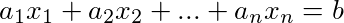
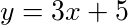
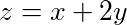
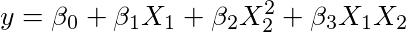

Linear Algebra Review I
=======================

- Keith Hughitt
- June 22, 2016

## 1.1 Linear Equations in Linear Algebra

First off, from the venerable [Wikipedia](https://en.wikipedia.org/wiki/Linear_algebra):

> Linear algebra is the branch of mathematics concerning vector spaces and
> linear mappings between such spaces. It includes the study of lines, planes,
> and subspaces, but is also concerned with properties common to all vector
> spaces.


Figure: Portrait of [Gottfried Wilhelm
Leibniz](https://en.wikipedia.org/wiki/Gottfried_Wilhelm_Leibniz) by Christoph
Bernhard Francke. Leibniz was one of the earliest contributors to the study of
linear algebra with his study of [determinants](https://en.wikipedia.org/wiki/Determinant).
(Source: [Wikipedia](https://en.wikipedia.org/wiki/Gottfried_Wilhelm_Leibniz#/media/File:Gottfried_Wilhelm_von_Leibniz.jpg))

### Linear equations

#### Overview

> A **linear equation** in the variables x1,...,xn is an equation that can be
> written in the form:



> where b and the **coefficients** a1,...,1n are real or complex numbers,
> usually known in advance.

Most of what we will encounter during our review of linear algebra will be
simple linear equations:

> A linear equation is an algebraic equation in which each term is either a
> constant or the product of a constant and (the first power of) a single
> variable. -Wikipedia

So things like a line in two-dimensional space:



or a plane in three-dimensional space:



In higher dimensions, this generalizes to a n-1 dimensional hyperplane in
n-dimensional space.

#### Equations for a line

Two-dimensional linear equations are commonly represented in different forms:

1. General form


or


2. Slope-intercept form


3. Point-slope form


where (x1, y1) is any point on the line.

4. Parametric form

Simultaneous equations:


and


(See [Wikipedia](https://en.wikipedia.org/wiki/Linear_equation#Forms_for_two-dimensional_linear_equations)
for a more exhaustive list of the ways lines can be represented.)

#### Linear in the parameters

While our review of linear algebra will primarily focus on the simple types of
linear equations described above. For these equations, each term in the
equation consists of a constant multiplied by a variable.

In other contexts such as linear regression, the variable part of each term may
be transformed, even in a nonlinear way, e.g.:

<!-- 
y = \beta_0 + \beta_1 X_1 + \beta_2 X_2^2 + \beta_3 X_1 X_2
-->


> A model is linear when each term is either a constant or the product of a
> parameter and a predictor variable. A linear equation is constructed by
> adding the results for each term. (Minitab blog [4])

- This allows for the introduction of curviture into the regression fit.
- Thus, a _linear_ model can be used to fit a _nonlinear_ relationship.

A example of this is [polynomial regression](https://en.wikipedia.org/wiki/Polynomial_regression):

> ...The mean of the response variable is a linear combination of the parameters 
> (regression coefficients) and the predictor variables. Note that this
> assumption is much less restrictive than it may at first seem. Because the
> predictor variables are treated as fixed values (see above), linearity is
> really only a restriction on the parameters. The predictor variables themselves
> can be arbitrarily transformed, and in fact multiple copies of the same
> underlying predictor variable can be added, each one transformed differently.
> This trick is used, for example, in polynomial regression, which uses linear 
> regression to fit the response variable as an arbitrary polynomial function 
> (up to a given rank) of a predictor variable.
> -Wikipedia

### Systems of Linear equations

#### Some definitions

- **system of linear equations** (aka **linear system**): collection of one or
  more linear equations using the same variables.
- **solution**: List of numbers that makes each equation evaluate to a true
  statement when substituted for the variables in a linear system.
- **solution set**: The set of all possible solutions for a linear system.
- **equivalence**: Two linear systems are said to be equivalent if they share
  the same solution set.

#### Geometric interpretation

For two variables, the solution set represents the intersection (if it occurs)
of two lines:


(source: [Wikipedia](https://en.wikipedia.org/wiki/Linear_equation#/media/File:Linear_Function_Graph.svg))

A point (x1,x2) is a solution (satisfies both equations) iff it lies on both lines.

For three variables, the solution set represents the intersection of planes in
three dimensional space, e.g. for two equations:


(source: [Wikipedia](https://en.wikipedia.org/wiki/File:Intersecting_Planes_2.svg))

and for three equations in three variables:


(source: [Wikipedia](https://en.wikipedia.org/wiki/System_of_linear_equations#/media/File:Secretsharing_3-point.svg))


#### Possible solutions

A system of linear equations has either:

1. No solutions (e.g. two linear that don't intersect)
2. One solution (e.g. lines intersecting at a single point)
3. Infinitely many solutions (e.g. two equations describing the same line)

This makes sense because we are talking about equations of _lines_. Unlike
parabolas, etc., a line can't intersect another line multiple times, unless
they are the same.

### Matrix notation

A linear system can be represented using a single matrix:

- **coefficient matrix**: values represent variable coefficients
- **augmented matrix**: same thing but with the RHS constant part of the linear
  equations.

Example (Wikipedia):

System of linear equations:


Augmented matrix for that system:


Dimension (rows x columns):

- _m_ x _n_ (Lay)
- _n_ x _p_ (Commonly used in machine learning)

### Matrix applications

While we are on the topic, here are some of the many interpretations and
applications of matrices:

1. Systems of linear equations
2. Planes in three dimensional space
3. Data matrices (e.g. with rows = observations and columns = features)
4. Images (2d matrices representing intensity across spatial dimensions)
5. Covariance matrices
6. Linear maps

### Solving a linear system

To solve a linear set of equations, we use **elementary row operations** to
iteratively replace our system of equations with a simpler _equivalent_ system.

#### Elementary row operations

1. **Replacement** - Replace one row by the sum of itself with a multiple of
   another row.
2. **Interchange** - Swap two rows.
3. **Scaling** - Replace a row my the product of itself with a non-zero
   constant.

- Two matrices are said to be **row equivalent** if you can switch between them
using only elementary row operations.
- If two augmented matrices are row equivalent, the the two systems have the
  same solution set.

Example:


(Source: [Wikpedia](https://en.wikipedia.org/wiki/System_of_linear_equations); Thank you Wikipedia for saving me from so much typing!)

#### Existence and Uniqueness

A couple important questions to consider about a set of equations:

- Does a system of equations have at least one solution (is is **consistent**?)
- If a solution exists, is it unique?

## 1.2 Row Reduction and Echelon Forms

To solve a linear system of equations, we would like to use elementary row
operations to transform our matrix into **echelon form** or **reduced echelon
form**.

### Echelon Form

Three requirements for a rectangular matrix to be in echelon form:

1. non-zero rows above rows of all zeros
2. each leading entry is in a column to the right of that of the row above
    - **leading entry**: left-most non-zero value in a matrix row.
3. all entries in columns below leading entries are zero.

### Reduced Echelon Form

If it satisfies two additional requirements, then it is considered to be in
**_reduced_** echelon form:

4. Each leading entry is 1.
5. For each row, the only non-zero value is the leading entry.

_For each matrix, there is only a single reduced echelon form matrix associated
with it._

In the context of systems of linear equations, this is nice because it 
corresponds directly with the solution for the system:


(source: [Wikipedia](https://en.wikipedia.org/wiki/Gaussian_elimination))

### Pivot positions

- **pivot position**: position in a matrix where a leading entry is found in 
the matrix's reduced echelon form.
- **pivot column**: column in matrix containing a pivot position
- **pivot**: number in a pivot position.

### Row reduction algorithm (Gaussian Elimination)

The first part (forward phase) produced an echelon matrix form; the second part
(backward phase) results in a _reduced_ echelon form.

**The forward phase**

- Begin with the leftmost nonzero column. This is a pivot column. The pivot
  position is at the top.
- Select a nonzero entry in the pivot column as a pivot. If necessary,
  interchange rows to move this entry into the pivot position.
- Use row addition operations to create zeros in all positions below the pivot.
- Cover (or ignore) the row containing the pivot position and cover all rows,
  if any, above it. apply steps 1-3 to the submatrix that remains. Repeat the
  process until there are no more nonzero rows to modify.

**The backward phase**

- Beginning with the rightmost pivot and working upward and to the left, create
  zeros above each pivot. If a pivot is not 1, make it 1 by a scaling operation.

(Source: http://people.math.aau.dk/~ottosen/MMA2011/rralg.html)

### Free variables

- **basic variables**: variables associated with pivot columns
- **free variables**: variables which can be reduced rows of all zeros.

When a system of equations contains a free variable, the variable is "free" to
be assigned any value. Each value chosen is then associated with a different
solution to the system of equations.


### Row reduction in R

#### pracma

The [rref](http://www.inside-r.org/packages/cran/pracma/docs/rref) function in 
the [pracma](http://www.inside-r.org/packages/cran/pracma) package has a
function for determining the reduced echelon form of a matrix.

Example from documentation:

```r
A <- matrix(c(1, 2, 3, 1, 3, 2, 3, 2, 1), 3, 3, byrow = TRUE)
rref(A)       
#      [,1] [,2] [,3]
# [1,]    1    0    0
# [2,]    0    1    0
# [3,]    0    0    1
```

#### matlib

The `echelon` function in the
[matlib](https://cran.r-project.org/web/packages/matlib/index.html) package (a
library designed for _teaching_ linear algebra) is also capable of determining
the reduced echelon form of a matrix, but goes one step further in showing all
of the intervening steps:

```r
> library('matlib')
> A <- matrix(c(2, 1, -1,
... -3, -1, 2,
... -2, 1, 2), 3, 3, byrow=TRUE)
> b <- c(8, -11, -3)
> echelon(A, b, verbose=TRUE, fractions=TRUE)

Initial matrix:
     [,1] [,2] [,3] [,4]
[1,]   2    1   -1    8 
[2,]  -3   -1    2  -11 
[3,]  -2    1    2   -3 

row: 1 

 exchange rows 1 and 2 
     [,1] [,2] [,3] [,4]
[1,]  -3   -1    2  -11 
[2,]   2    1   -1    8 
[3,]  -2    1    2   -3 

 multiply row 1 by -1/3 
     [,1] [,2] [,3] [,4]
[1,]    1  1/3 -2/3 11/3
[2,]    2    1   -1    8
[3,]   -2    1    2   -3

 multiply row 1 by 2 and subtract from row 2 
     [,1] [,2] [,3] [,4]
[1,]    1  1/3 -2/3 11/3
[2,]    0  1/3  1/3  2/3
[3,]   -2    1    2   -3

 multiply row 1 by 2 and add to row 3 
     [,1] [,2] [,3] [,4]
[1,]    1  1/3 -2/3 11/3
[2,]    0  1/3  1/3  2/3
[3,]    0  5/3  2/3 13/3

row: 2 

 exchange rows 2 and 3 
     [,1] [,2] [,3] [,4]
[1,]    1  1/3 -2/3 11/3
[2,]    0  5/3  2/3 13/3
[3,]    0  1/3  1/3  2/3

 multiply row 2 by 3/5 
     [,1] [,2] [,3] [,4]
[1,]    1  1/3 -2/3 11/3
[2,]    0    1  2/5 13/5
[3,]    0  1/3  1/3  2/3

 multiply row 2 by 1/3 and subtract from row 1 
     [,1] [,2] [,3] [,4]
[1,]    1    0 -4/5 14/5
[2,]    0    1  2/5 13/5
[3,]    0  1/3  1/3  2/3

 multiply row 2 by 1/3 and subtract from row 3 
     [,1] [,2] [,3] [,4]
[1,]    1    0 -4/5 14/5
[2,]    0    1  2/5 13/5
[3,]    0    0  1/5 -1/5

row: 3 

 multiply row 3 by 5 
     [,1] [,2] [,3] [,4]
[1,]    1    0 -4/5 14/5
[2,]    0    1  2/5 13/5
[3,]    0    0    1   -1

 multiply row 3 by 4/5 and add to row 1 
     [,1] [,2] [,3] [,4]
[1,]    1    0    0    2
[2,]    0    1  2/5 13/5
[3,]    0    0    1   -1

 multiply row 3 by 2/5 and subtract from row 2 
     [,1] [,2] [,3] [,4]
[1,]  1    0    0    2  
[2,]  0    1    0    3  
[3,]  0    0    1   -1  
> 
```


## References

1. [Linear Algebra and its applications (Lay 3e)](http://www.laylinalgebra.com/)
2. [Linear Equation - Wikipedia](https://en.wikipedia.org/wiki/Linear_equation)
3. [Linear Regression - Wikipedia](https://en.wikipedia.org/wiki/Linear_regression)
4. [What Is the Difference between Linear and Nonlinear Equations in Regression Analysis?](http://blog.minitab.com/blog/adventures-in-statistics/what-is-the-difference-between-linear-and-nonlinear-equations-in-regression-analysis)
5. [The Row Reduction Algorithm](http://people.math.aau.dk/~ottosen/MMA2011/rralg.html)

