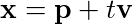
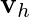
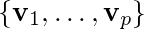
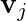

Linear Algebra Review III
=======================

- Candice Schumann
- July 6, 2016

## 1.5 Solution Sets of Linear Systems

A homogeneous equation always has one solution, the zero vector.

The homogeneous equation has a nontrivial solution if and only if the equation has at least one free variable.

#### Parametric Vector Form

This form explicitly describes the plane as the set spanned by vectors **u** and **v**. It emphasizes that the parameters vary over all real numbers.

#### Solutions of Nonhomogeneous Systems

When a nonhomogeneous linear system has many solutions, the general solution can be written in parametric vector form as one vector plus an arbitrary linear combination of vectors that satisfy the corresponding homogeneous system.

The solution to *A***x**=**b** can be written as

The solution to *A***x**=**0** can be written as

#### Theorem 6

Suppose the equation  is consistent for some given **b**, and let **p** be a solution. Then the solution set of  is the set of all vectors of the form , where  is any solution of the homogenous equation .

## 1.7 Linear Independence

#### Definition of Linear Independence

An indexed set of vectors  in  is said to be linearly independent if the vector equation 

has only the trivial solution. The set  is said to be linearly dependent if there exists weights , not all zero, such that

Therefore by section 1.5, the vectors are dependent if the equation  has at least one free variable. If there are no free variables then the vectors are independent.

#### Special cases

If a set only contains one vector then the set is independent if that vector is not the zero vector.

A set of two vectors is linearly dependent if at least one of the vectors is a multiple of another. The set is linearly independent if and only if neither of the vectors is a multiple of the other.

#### Linearly dependent sets

An indexed set  of two or more vectors is linearly dependent if and only if at least one of the vectors in  is a linear combination of the others. In fact, if  is linearly dependent and , then some  (with ) is a linear combination of the preceding vectors, .

#### Theorem 8

If a set contains more vectors than there are entries in each vector, then the set is linearly dependent. That is, any set  in  is linearly dependent if .

#### Theorem 9

If a set  in  contain the zero vector, then the set is linearly dependent.
