Linear Algebra Review III
=======================

- Jonathan Goodson
- July 12, 2016

## 1.8 Linear Transformations

This section concerns viewing a matrix equation in ways other than a represenation of a system of equations. In this case we will treat matrix *A* as an object that acts on a vector **x**.

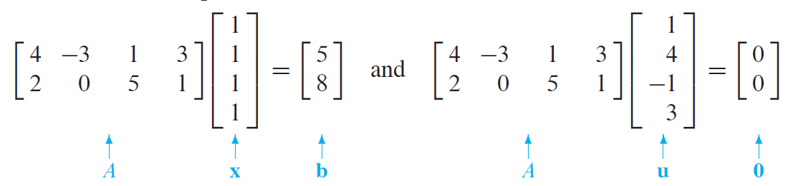
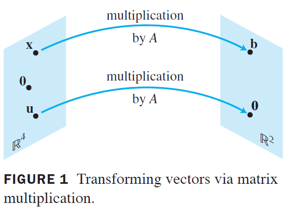

This means that a matrix can be thought of a *function* from **x** -> *A***x**. 

Vocabulary time!

This concept of a **transformation** can also be called a **function** or **mapping** of a vector from ℝn to ℝm. This repreresents a matrix that transforms a vector **x** in ℝn to a vector *T*(**x**) in ℝm.

The input to the function  ℝn is called the **domain** of *T*, while the output of the function is  ℝm is the **codomain**. For **x** in  ℝn (the input) the vector *T*(**x**) (the output) is called the **image** of **x** (under *T*). The set of all *T*(**x**) is called the **range** of *T*.

#### Matrix Transformations

Some ways to think about matrix multiplication in the context of transformations.

The domain of *T* is  ℝn when *A* has *n* columns and the codomain is  ℝm when *A* has *m* columns. This is very important to keep straight, but it follows from the properties of matrix multiplication. The range of *T* (defined as all *T*(**x**)) is the set of all linear combinations of the columns of *A* (also follows from the properties we learned earlier with new terminology bolted on).

Mapping concepts of matrix transformations to problems we have solved earlier.

* Find *T(**u**), the image of **u** under the transformation *T*: This means to compute *A***u**.
* Find an **x** in  ℝn whose image under *T* is **b**: This means to solve the matrix equation *T*(**x**)=**b** or *A***x**=**b**
* Is there more than one **x** whose image under *T* is **b**: This asks whether the solution of *A***x**=**b** has only one *unique* solution
* Determine if **c** is in the range of the transformation *T*: This asks whether *A***x**=**c** is *consistent*, whether there *exists* a solution **x**.

#### Linear Transformations

Back to new math instead of new terminology.

An important theorem earlier (In section 1.4) showed 

*A*(**u**+**v**)=*A***u**+*A***v** and *A*(*c***u**)=*A**c***u**)

This becomes more important since this defines the property of **linearity** of a transformation.

(i) *T*(**u**+**v**) = *T*(**u**)+*T*(**v**) for all **u**, **v** in the domain of *T*
(ii) *T*(*c***u**) = *c**T*(**u**) for all scalars *c* and **u** in the domain of *T*

Because matrix multiplcation (and therefore matrix transformations) follow these rules, all matrix transformations are linear (but not necessarily the converse?)

If we map more properties of matrix multiplcation onto transformations we can generate more proprties.

If *T* is a linear transformation:

*T*(**0**) = **0**
*T*(*c***u**+*d***v**) = *c**T*(**u**) + *d**T*(**v**) 

for all **u**, **v** in domain of *T* and scalars *c*, *d*.

## 1.9 Matrix transformations, Bonus Round

We have already learned that a matrix *A* multiplied by vector **x** is completely equivalent to the transformation *T*(**x**), so *A* defines *T*. 

First we learn a convenient relationship between a transformation and the image of the columns of the identity matrix *I*n under *T*

 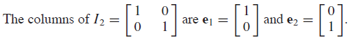
 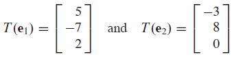
 
 With this information we can find out everything we need to know about *T* and the image of any **x** under *T*
 
 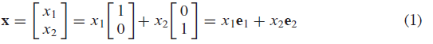
 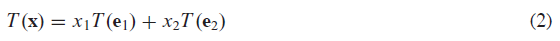
 
 Since *T*(**e**1) and *T*(**e**2)
 are vectors *T*(**x**):

 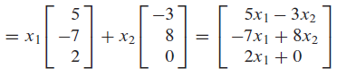
  
 Furthermore:
 
 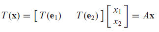
 
This is genearlized to the next theorem:

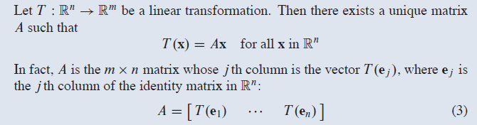

The matrix *A* in theoreum 10 eqn 3 is known as the **standard matrix for the linear transformation** *T*.

There are many terms for a transformation and what it does to arbitrary vectors in ℝn geometrically. These can be more easily understood by applying the transformation to the identity matrix. See book for the giant tables.

Definitions:

A mapping *T* : ℝn -> ℝm is **onto** ℝm if each **b** in ℝm is the image of *at least one* **x** in ℝn.

Think: can every possble **b** in ℝm (the output) be reached by an **x** in ℝn (the input)

A mapping *T* : ℝn -> ℝm is **one-to-one** if each **b** in ℝm is the image of *at most one* **x** in ℝn. (Possible no **x** can map to **b**!)

Think: *T*(**x**) = **b** must have either no solution or a unique solution.

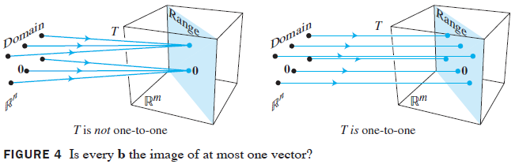

Useful theorems governing these relationships:

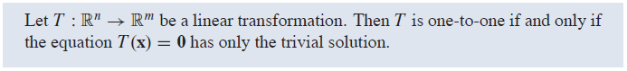
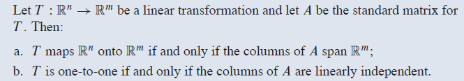
