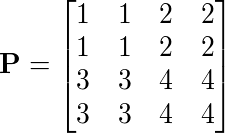
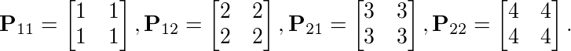
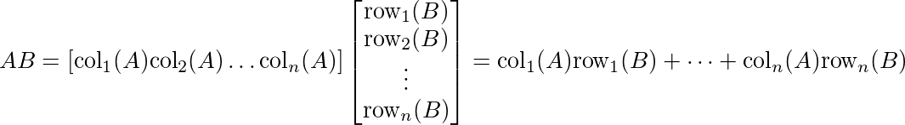
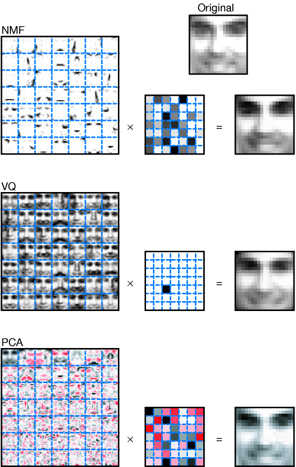
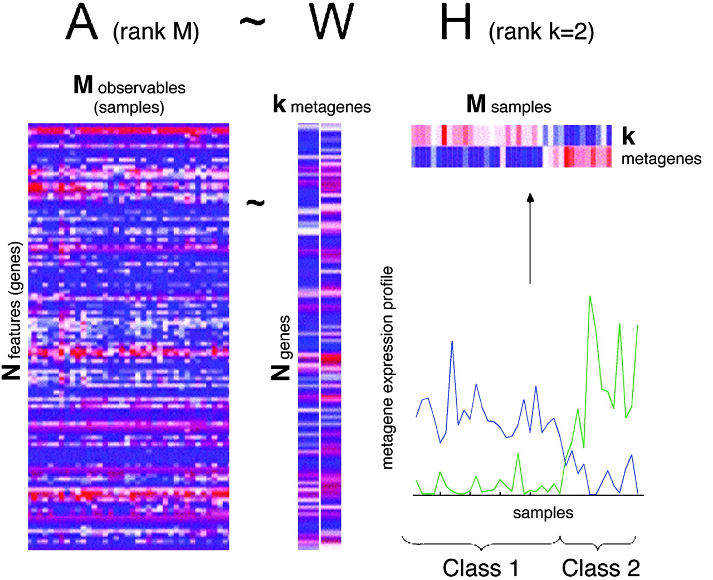

---
output:
  md_document:
    variant: markdown_github
    md_extensions: +tex_math_dollars
    pandoc_args: ['--webtex']
    toc: true
    toc_depth: 2
---

```{r include=FALSE}
library(knitcitations)
library(knitr)
opts_chunk$set(fig.path='img/',
               fig.width=1080/120,
               fig.height=1080/120,
               dpi=120, fig.retina=2)
```

<h1>Linear Algebra Review VII</h1>

- Keith Hughitt
- August 05, 2016

Partitioned Matrices
====================

Matrix partitioning takes a single matrix and breaks it up into multiple 
submatrices.

Example from Wikipedia: suppose we have a $4 \times 4$ matrix, $P$:



<!--
$$
\mathbf{P} = \begin{bmatrix}
1 & 1 & 2 & 2\\
1 & 1 & 2 & 2\\
3 & 3 & 4 & 4\\
3 & 3 & 4 & 4\end{bmatrix}
$$
-->

This matrix could be partitioned into four submatrices:

<!--
$$
\mathbf{P}_{11} = \begin{bmatrix}
1 & 1 \\
1 & 1 \end{bmatrix},   \mathbf{P}_{12} = \begin{bmatrix}
2 & 2\\
2 & 2\end{bmatrix},  \mathbf{P}_{21} = \begin{bmatrix}
3 & 3 \\
3 & 3 \end{bmatrix},   \mathbf{P}_{22} = \begin{bmatrix}
4 & 4\\
4 & 4\end{bmatrix}.
$$
-->



We could then rewrite the partitioned or **block matrix** as:

<!--
$$
\mathbf{P} = \begin{bmatrix}
\mathbf{P}_{11} & \mathbf{P}_{12}\\
\mathbf{P}_{21} & \mathbf{P}_{22}\end{bmatrix}.
$$
-->


So far, we have already considered one type of partitioned matrix: the division 
of A into a set of column vectors.

Chapter 2.4 in Lay generalizes this idea to other arbitrary types of partitions
such as that above, and describes the algebraic rules for working with such matrices.

This can be useful, for example, for breaking up a very large matrix into 
smaller matrices which can be operated on in memory, or for efficiently storing
large sparse matrices.

## Addition and Scalar multiplication

- If two matrices have the same size and are partitioned similarly, the sum of
the matrices is defined, and is performed block-wise.
- Scalar multiplication can also be applied block-by-block.

## Multiplication of partitioned matrices

For partitioned matrices $A$ and $B$, the matrix product $AB$ is defined if the 
column parition of $A$ matches the row partition of $B$.

Such compatible paritionings are said to be **conformable** for block
multiplication.

In this case, we can use the usual row-column rule for matrix multiplication, e.g.

<!--
$$
\mathbf{AB} = \begin{bmatrix}
A_{11} & A_{12}\\
A_{21} & A_{22}
\end{bmatrix}
\begin{bmatrix}
B_1\\
B_2
\end{bmatrix}
=
\begin{bmatrix}
A_{11}B_1 + A_{12}B_2\\
A_{21}B_1 + A_{22}B_2\\
\end{bmatrix}
$$
-->


## Views of matrix products

So far, we have considered several different ways of viewing matrix-related
products, using partitions:

1. The definition of $A\mathbf{x}$ using the columns of $A$
2. The column definition of $AB$
3. The row-column rule for computing $AB$
4. The rows of $AB$ as the products of the rows of $A$ and the matrix $B$

Section 2.4 defines fifth way of viewing the matrix product $AB$ (columnr-row 
expansion), described below.

## The column-row expansion of $AB$

**Theorem 10**

If $A$ is $m \times n$ and $B$ is $n \times p$,then:

<!--
$$
AB = [\text{col}_1(A) \text{col}_2(A)  \dots \text{col}_n(A)]
\begin{bmatrix}
\text{row}_1(B)\\
\text{row}_2(B)\\
\vdots\\
\text{row}_n(B)\\
\end{bmatrix}
= \text{col}_1(A)\text{row}_1(B) + \dots + \text{col}_n(A)\text{row}_n(B)
$$
-->



## Inverses of partitioned matrices

Analytic formula for the inverse of a block matrix, courtesy of [Wikipedia](https://en.wikipedia.org/wiki/Invertible_matrix#Blockwise_inversion):

<!--
$$
\begin{bmatrix} \mathbf{A} & \mathbf{B} \\ \mathbf{C} & \mathbf{D} \end{bmatrix}^{-1} = \begin{bmatrix} \mathbf{A}^{-1}+\mathbf{A}^{-1}\mathbf{B}(\mathbf{D}-\mathbf{CA}^{-1}\mathbf{B})^{-1}\mathbf{CA}^{-1} & -\mathbf{A}^{-1}\mathbf{B}(\mathbf{D}-\mathbf{CA}^{-1}\mathbf{B})^{-1} \\ -(\mathbf{D}-\mathbf{CA}^{-1}\mathbf{B})^{-1}\mathbf{CA}^{-1} & (\mathbf{D}-\mathbf{CA}^{-1}\mathbf{B})^{-1} \end{bmatrix}
$$
-->


where $A$, $B$, $C$ and $D$ are matrix sub-blocks of arbitrary size.

Matrix Factorization
====================

In matrix _factorization_ or _decomposition_, we _decompose_ a single matrix
into two or more matrices, which, when multipled together, form A.

This is similar to the idea of numerical factorization (e.g. 24 = 2 x 3 x 4).

Examples of matrix factorizations:

1. _LU_ factorization
2. Singular value decomposition (SVD)
3. Non-negative matrix factorization (NMF)

Below, we discuss the _LU_ factorization and NMF. SVD is extremely useful and
we will revisit it later after we review eigenvectors and eigenvalues (chapter 5).

## LU factorization

### Overview


(source: [Wikipedia](https://en.wikipedia.org/wiki/Alan_Turing#/media/File:Alan_Turing_Aged_16.jpg))

- LU decomposition (factorization) involves the decomposition of a matrix into
  a lower triangular matrix (L) and and upper triangular matrix (U).
- The L and U matrices effectively "encode" the row reduction steps needed to
  solve a system of linear equations.
- Formulated by Alan Turing in 1948.


(source: [Wikipedia](https://en.wikipedia.org/wiki/LU_decomposition))

### Applications

- Solving systems of equations
- Matrix inversion
- Computing determinants
- Especially useful when you want to solve multiple systems of equations 
  involving the same Matrix-vector $Ax$.
	- Up-front computational cost
	- Much faster solutions for subsequent systems
 	- Used by many computational solvers.

## Non-negative matrix factorization

### Overview

Another useful matrix factorization is the non-negative matrix factorization
(NMF). Popularised by Lee & Seung (1999), the method is now used for many
different problems, e.g.:

- image recognition
- network community detection
- clustering
- latent feature detection
- recommendation systems

One of the defining features of NMF compared with other similar techniques such
as principal components analysis (PCA) and vector quantization (VQ) is that NMF
is able to arrive at a **parts-based local representation** of an input matrix
(see the figure from Lee & Seung below for a qualitative example of this).

### Definition

Let $V$ be an $p \times n$ _non-negative_ matrix. NMF attempts to find
_non-negative_ matrices $W$ ($p \times k$) and $H$ ($k \times n$), whose
product _approximates_ $V$:

$$
V \approx WH
$$

Here, the information contained in $V$ is split into the $k$ columns of $W$,
or, in other words, the $k$ columns of $W$ represent _latent factors_ present
in the original matrix $V$.


(Source: [Wikipedia](https://en.wikipedia.org/wiki/Non-negative_matrix_factorization))

### Determining $W$ and $H$

There are a number of different ways to find matrices $W$ and $H$ for which $V
\approx WH$.

#### Basic steps

1. Select a factorization rank ($k$)
2. Initialize matrices $W$ and $H$ using a specified seeding method (e.g.
   random positive uniform distribution)
3. Select a loss function to measure distance between $V$ and $WH$
4. Iteratively update $W$ and $H$ to minimize the loss function selected above.

#### Loss functions

One of the key factors for performing NMF is the selection of an appropriate
loss function.

While we could choose something as simple as [euclidean distance](https://en.wikipedia.org/wiki/Euclidean_distance),
a better result can be obtained using something like
[Kullback Leibler divergence](https://en.wikipedia.org/wiki/Kullback%E2%80%93Leibler_divergence).

KL divergence (aka "relative entropy" or "information gain") is a measure of
the difference between two probability distributions (often, a true
distribution and some estimate of it).

For discrete distributions, the KL divergence between discrete distributions
$P$ and $Q$ is defined as:

$$
D_{\mathrm{KL}}(P\|Q) = \sum_i P(i) \, \log\frac{P(i)}{Q(i)}
$$

(For continuous distributions, simply take the integral instead...)

So, applied NMF, we get:

$$
KL(A||B) = \sum{V_{ij} log \frac{V_{ij}}{(WH)_{ij}} - V_{ij} + (WH)_{ij}}_{i,j}
$$

(I'm not exactly sure where the lass two terms of the summation came from?...
they appear in all of the NMF KL divergence formulations, but are not part of
the original definition of KL divergence; feel free to update if you know the
answer...)

#### Estimating factorization rank

For clustering applications, when $k$ is not known in advance, their are
methods for estimating the factorization rank (e.g. see section 2.6 of the
`nmf` package vignette)

### NMF versus other matrix decomposition approaches

As an example, Lee & Seung, (1999) demonstrated the use of NMF for image and
text classification, and compared this with two other commonly used matrix
decomposition approaches: VQ and PCA.



> We have applied non-negative matrix factorization (NMF), together with
> principal components analysis (PCA) and vector quantization (VQ), to a
> database of facial images. As shown in Fig. 1, all three methods learn to
> represent a face as a linear combination of basis images, but with
> qualitatively different results. VQ discovers a basis consisting of
> prototypes, each of which is a whole face. The basis images for PCA are
> 'eigenfaces', some of which resemble distorted versions of whole faces6. The
> NMF basis is radically different: its images are localized features that
> correspond better with intuitive notions of the parts of faces.

(Source: Lee & Seung, 1999)

**Matrices**

- left matrix = basis images
- right matrix = weights
- final image = linear combination of basis images, using the weights from the
  right matrix.

The main difference between the three approaches has to do with the constraints
imposed on each of them:

#### Vector Quantization 

- Each column in $H$ must be a unary vector (all zeros except for one position,
  set to 1).
- Each face (column in $V$) is approximated by a single basis image (column in
  $W$)

#### Principal component analysis

- Unary constraint of VQ is relaxed
- Faces can be constructed from a linear combination of all basis images
- Basis images may contain positive and negative values
- Basis images (principal components or "eigenfaces") each capture some major
  component of the variance in the original image database.

#### Non-negative matrix factorization

- Similar to PCA in that $V$ is approximated by a linear combination of the
  basis images, however,
- Basis images are required to be non-negative.
- Summing basis images (with corresponding weights), thus builds up the final
  approximated image "piece-by-piece"

Finally, another notable property of NMF which differs it from both VQ and PCA
is it's **sparsity** in both $W$ _and_ $H$ (VQ is sparse in $H$, but is very
dense in $W$). This is due to NMF's ability to capture _local_ parts of a
dataset.

This sparsity can be induces during the generation of the matrices $W$ and $H$
by adding a penalty component to the objective function to be minimized (i.e.
regularization).

### Applications in Computational Biology (Devarajan, 2008)

The next few sections summarise some of the key ideas from a 2008 review paper
by Karthik Devarajan, "Nonnegative matrix factorization: An analytical and
interpretive tool in computational biology".

#### A. Clustering of expression data (Brunet et al. 2004)

One common use of NMF is for clustering "molecular profile" (e.g. gene
expression data).

For example, we may wish to cluster samples based on their expression profiles.


In this case, we have matrices:

- $V$ ($p \times n$)
- $W$ ($p \times k$)
- $H$ ($k \times n$)

Where:

- $p$ = # genes
- $n$ = # samples
- $k$ = # _metagenes_ (i.e. # of latent factors to detect)

**Metagenes**

- Metagenes are described as being 'non-negative linear combinations of $p$
  genes'
- Note that `len(metagene) == len(sample)`
    - i.e. Each metagene is a ~10,000 long vector representing (hopefully) some
      specific subset of the samples.

**Interpretation**

- $W_{ia}$ = The influence of the $a^{th}$ metagene expression pattern
  ($h_{aj}$) on the gene expression of the $i^{th}$ sample, or,
    - entries in columns($W$) -> relevance of genes to metagene
    - entries in rows($H$) -> relevance of latent factors

      - In other words, it's the contribution of metagene $a$ to the expression
       profile for sample $i$.

**Clustering samples vs. genes**

Note that the way the problem has been framed above, we are clustering
_samples_. NMF can just as easily be used to _cluster_ the genes (just take the
transpose of $V$).



### R package for NMF

The [NMF package for R](https://cran.r-project.org/web/packages/NMF/index.html) 
(Gaujoux & Seoighe, 2010) provides implementations for several different
algorithms for NMF, along with a general framework for implementing and testing
new algorithms.

Note that the notation for the dimensions of the matrix to be approximated, $X$
($V$) in the `NMF` vignette is precisely reversed from that used in the review
text above ($n \times p$ in the former vs. $p \times n$ in the later).

To see which algorithms are available, you can use the `nmfAlgorithm()`
function:

```{r}
library('NMF')
nmfAlgorithm()

# retrieve a specific algorithm by passing its name to the function
nmfAlgorithm("brunet")
```

To perform the NMF on our data, we use the `nmf()` function:

```{r}
args(nmf)
```

`x` is our data, `rank` is the number of latent factors (metagenes) to detect,
method is the algorithm we wish to use.

Further, a `seed` parameter can also be used to specify a seeding method to use
for $W$ and $H$, which turns out to be quite important for NMF (see vignettes
for details).

Next, we will use NMF to cluster an example dataset containing expression
profiles for 5000 genes across 38 leukemia samples of two different types:

- lymphoblastic leukemia (ALL)
- myeloid leukemia (AML)

From the description for the dataset (`?esGolub`):

> This data comes originally from the gene expression data from Golub et al.
> (1999). The version included in the package is the one used and referenced in
> Brunet et al. (2004). The samples are from 27 patients with acute
> lymphoblastic leukemia (ALL) and 11 patients with acute myeloid leukemia
> (AML).

```{r}
data(esGolub)
esGolub

table(pData(esGolub)$ALL.AML)

# only the ALL samples have a cell type specified
table(pData(esGolub)$Cell)
```

Let's first see how things look using PCA:

```{r esGolub_PCA_plot}
library('ggplot2')

pca <- prcomp(t(exprs(esGolub)))

df <- data.frame(sample_id=colnames(esGolub),
                    pc1=pca$x[,1], pc2=pca$x[,2],
                    type=pData(esGolub)$ALL.AML,
                    cell=pData(esGolub)$Cell)

ggplot(df, aes(pc1, pc2, color=cell, shape=type)) +
    geom_point(stat="identity",size=5) +
    geom_text(aes(label=sample_id), angle=45, size=4,vjust=2) +
    xlab('PC1') + ylab('PC2') +
    ggtitle("PCA: esGolub") +
    theme(axis.ticks=element_blank(), axis.text.x=element_text(angle=-90))
```

Next, let's perform NMF on the data using the default algorithm and seeding
method with `rank=3`:

```{r}
result <- nmf(esGolub, 3)
result
```

Use `fit()` to get the fitted model:

```{r}
fit(result)
```

and `fitted()` to get the approximated version of $V$:

```{r}
v0 <- fitted(result)
```

Which is just the product $WH$:

```{r}
all(v0 == w %*% h)
```

Next, we can use `basis()` and `coef()` to get $W$ and $H$, respectively:

```{r}
w <- basis(result)
dim(w)

h <- coef(result)
dim(h)
```

Let's visualize each of these:

```{r w}
library('gplots')
library('viridis')

# plot w (subsample rows to speed up)
# allowing rows to be reordered to show major differences
heatmap.2(w[sample(1:nrow(w), 500),], Rowv=FALSE, labRow=FALSE,
          dendrogram="none", main="W", col=viridis, trace="none",
          margins=c(5, 5))
```

```{r h}
# plot h
heatmap.2(h, Rowv=FALSE, Colv=FALSE, dendrogram="none", main="H", col=viridis,
          trace="none", margins=c(8, 6))
```

To use NMF for cluster the samples, we can take the max value for each column
in $H$ and use the row of that value as a cluster assignment:

```{r}
nmf_clusters <- apply(h, 2, which.max)
nmf_clusters
```

To see how this compares with the PCA assignments, we can redo the PCA plot,
but coloring samples according to their NMF clustering:

```{r pca_nmf_clusters}
df$cell <- factor(nmf_clusters)

ggplot(df, aes(pc1, pc2, color=cell, shape=type)) +
    geom_point(stat="identity",size=5) +
    geom_text(aes(label=sample_id), angle=45, size=4,vjust=2) +
    xlab('PC1') + ylab('PC2') +
    ggtitle("PCA: esGolub") +
    theme(axis.ticks=element_blank(), axis.text.x=element_text(angle=-90))
```

A couple of the ALL B-cell samples are mislabeled, but all-in-all, not bad!

References
==========

```{r refs_output, results='asis', eval=FALSE}
# disabling for now (issues with knitcitations...)
bibliography()
```

1. Lee,D.D. and Seung,H.S. (1999) Learning the parts of objects by non-negative
   matrix factorization. Nature, 401, 788–91.

2. R. Gaujoux and C. Seoighe. "A flexible R package for nonnegative matrix
   factorization". In: _BMC Bioinformatics_ 11.1 (2010), p. 367. DOI:
   10.1186/1471-2105-11-367. <URL: http://dx.doi.org/10.1186/1471-2105-11-367>.

3. Devarajan,K. (2008) Nonnegative matrix factorization: An analytical and
   interpretive tool in computational biology. PLoS Comput. Biol., 4.

4. https://en.wikipedia.org/wiki/LU_decomposition

See Also
=======

- [Matrix Factorization: A Simple Tutorial and Implementation in Python](http://www.quuxlabs.com/blog/2010/09/matrix-factorization-a-simple-tutorial-and-implementation-in-python/)

System Information
==================

```{r sysinfo, results='asis'}
library('knitr')

if (opts_knit$get("rmarkdown.pandoc.to") == 'latex') {
    toLatex(sessionInfo())
} else {
    library('pander')
    pander(sessionInfo())
}
```

