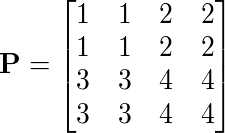
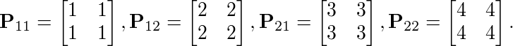
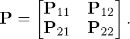
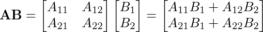
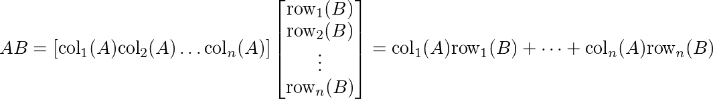
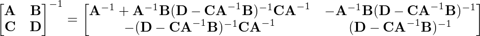
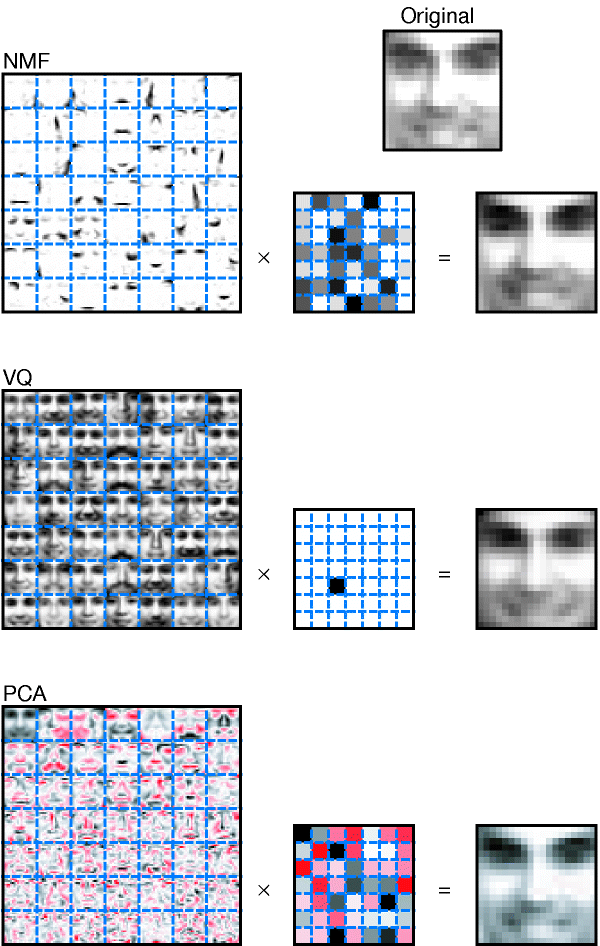
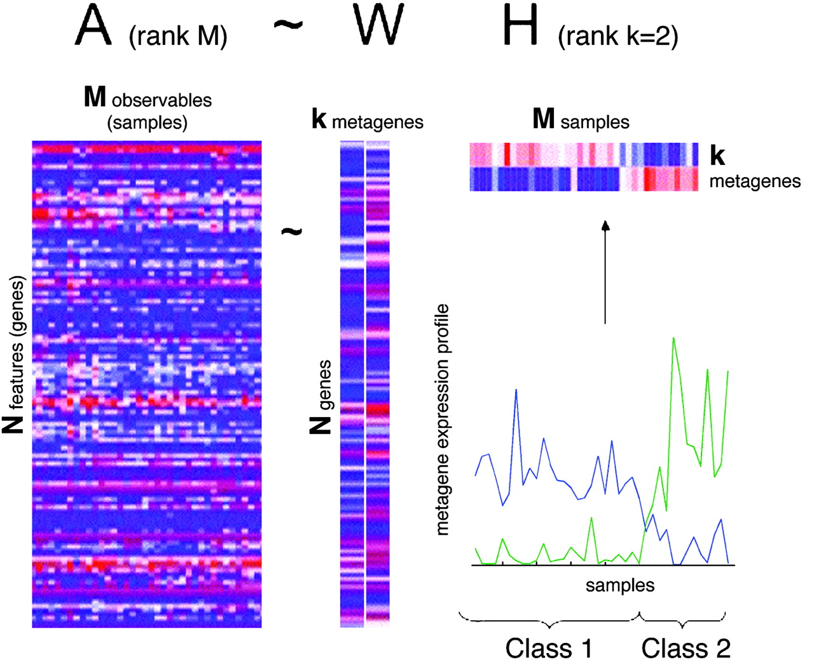

Linear Algebra Review VII
=========================

-   Keith Hughitt
-   August 05, 2016

2.4 Partitioned Matrices
------------------------

### Overview

Matrix partitioning takes a single matrix and breaks it up into multiple submatrices.

Example from Wikipedia: suppose we have a  matrix, :



<!--
$$
\mathbf{P} = \begin{bmatrix}
1 & 1 & 2 & 2\\
1 & 1 & 2 & 2\\
3 & 3 & 4 & 4\\
3 & 3 & 4 & 4\end{bmatrix}
$$
-->
This matrix could be partitioned into four submatrices:

<!--
$$
\mathbf{P}_{11} = \begin{bmatrix}
1 & 1 \\
1 & 1 \end{bmatrix},   \mathbf{P}_{12} = \begin{bmatrix}
2 & 2\\
2 & 2\end{bmatrix},  \mathbf{P}_{21} = \begin{bmatrix}
3 & 3 \\
3 & 3 \end{bmatrix},   \mathbf{P}_{22} = \begin{bmatrix}
4 & 4\\
4 & 4\end{bmatrix}.
$$
-->


We could then rewrite the partitioned or **block matrix** as:

<!--
$$
\mathbf{P} = \begin{bmatrix}
\mathbf{P}_{11} & \mathbf{P}_{12}\\
\mathbf{P}_{21} & \mathbf{P}_{22}\end{bmatrix}.
$$
-->


So far, we have already considered one type of partitioned matrix: the division of A into a set of column vectors.

Chapter 2.4 in Lay generalizes this idea to other arbitrary types of partitions such as that above, and describes the algebraic rules for working with such matrices.

This can be useful, for example, for breaking up a very large matrix into smaller matrices which can be operated on in memory, or for efficiently storing large sparse matrices.

### Addition and Scalar multiplication

-   If two matrices have the same size and are partitioned similarly, the sum of the matrices is defined, and is performed block-wise.
-   Scalar multiplication can also be applied block-by-block.

### Multiplication of partitioned matrices

For partitioned matrices  and , the matrix product  is defined if the column parition of  matches the row partition of .

Such compatible paritionings are said to be **conformable** for block multiplication.

In this case, we can use the usual row-column rule for matrix multiplication, e.g.

<!--
$$
\mathbf{AB} = \begin{bmatrix}
A_{11} & A_{12}\\
A_{21} & A_{22}
\end{bmatrix}
\begin{bmatrix}
B_1\\
B_2
\end{bmatrix}
=
\begin{bmatrix}
A_{11}B_1 + A_{12}B_2\\
A_{21}B_1 + A_{22}B_2\\
\end{bmatrix}
$$
-->


### Views of matrix products

So far, we have considered several different ways of viewing matrix-related products, using partitions:

1.  The definition of  using the columns of 
2.  The column definition of 
3.  The row-column rule for computing 
4.  The rows of  as the products of the rows of  and the matrix 

Section 2.4 defines fifth way of viewing the matrix product  (columnr-row expansion), described below.

### The column-row expansion of 

**Theorem 10**

If  is  and  is ,then:

<!--
$$
AB = [\text{col}_1(A) \text{col}_2(A)  \dots \text{col}_n(A)]
\begin{bmatrix}
\text{row}_1(B)\\
\text{row}_2(B)\\
\vdots\\
\text{row}_n(B)\\
\end{bmatrix}
= \text{col}_1(A)\text{row}_1(B) + \dots + \text{col}_n(A)\text{row}_n(B)
$$
-->


### Inverses of partitioned matrices

Analytic formula for the inverse of a block matrix, courtesy of [Wikipedia](https://en.wikipedia.org/wiki/Invertible_matrix#Blockwise_inversion):

<!--
$$
\begin{bmatrix} \mathbf{A} & \mathbf{B} \\ \mathbf{C} & \mathbf{D} \end{bmatrix}^{-1} = \begin{bmatrix} \mathbf{A}^{-1}+\mathbf{A}^{-1}\mathbf{B}(\mathbf{D}-\mathbf{CA}^{-1}\mathbf{B})^{-1}\mathbf{CA}^{-1} & -\mathbf{A}^{-1}\mathbf{B}(\mathbf{D}-\mathbf{CA}^{-1}\mathbf{B})^{-1} \\ -(\mathbf{D}-\mathbf{CA}^{-1}\mathbf{B})^{-1}\mathbf{CA}^{-1} & (\mathbf{D}-\mathbf{CA}^{-1}\mathbf{B})^{-1} \end{bmatrix}
$$
-->


where , ,  and  are matrix sub-blocks of arbitrary size.

2.5 Matrix Factorization (UNFINISHED)
-------------------------------------

In matrix *factorization* or *decomposition*, we *decompose* a single matrix into two or more matrices, which, when multipled together, form A.

This is similar to the idea of numerical factorization (e.g. 24 = 2 x 3 x 4).

Examples of matrix factorizations:

1.  *LU* factorization
2.  Singular value decomposition (SVD)
3.  Non-negative matrix factorization (NMF)

Below, we discuss the *LU* factorization and NMF. SVD is extremely useful and we will revisit it later after we review eigenvectors and eigenvalues (chapter 5).

### LU factorization

#### Overview

 (source: [Wikipedia](https://en.wikipedia.org/wiki/Alan_Turing#/media/File:Alan_Turing_Aged_16.jpg))

-   LU decomposition (factorization) involves the decomposition of a matrix into a lower triangular matrix (L) and and upper triangular matrix (U).
-   The L and U matrices effectively "encode" the row reduction steps needed to solve a system of linear equations.
-   Formulated by Alan Turing in 1948.

 (source: [Wikipedia](https://en.wikipedia.org/wiki/LU_decomposition))

#### Aplications

-   Solving systems of equations
-   Matrix inversion
-   Computing determinants
-   Especially useful when you want to solve multiple systems of equations involving the same Matrix-vector .
    -   Up-front computational cost
    -   Much faster solutions for subsequent systems
    -   Used by many computational solvers.

### Non-negative matrix factorization

#### Overview

Another useful matrix factorization is the non-negative matrix factorization (NMF). Popularised by Lee & Seung (1999), the method is now used for many different problems, e.g.:

-   image recognition
-   network community detection
-   clustering
-   latent feature detection
-   recommendation systems

#### Definition

Let  be an  non-negative matrix. NMF attempts to find non-negative matrices  () and  (), whose product approximates :

*V* ≈ *W**H*

Here, the information contained in  is split into the  columns of .

 (Source: [Wikipedia](https://en.wikipedia.org/wiki/Non-negative_matrix_factorization))

#### Image recognition (Lee & Seung, 1999)



> We have applied non-negative matrix factorization (NMF), together with principal components analysis (PCA) and vector quantization (VQ), to a database of facial images. As shown in Fig. 1, all three methods learn to represent a face as a linear combination of basis images, but with qualitatively different results. VQ discovers a basis consisting of prototypes, each of which is a whole face. The basis images for PCA are 'eigenfaces', some of which resemble distorted versions of whole faces6. The NMF basis is radically different: its images are localized features that correspond better with intuitive notions of the parts of faces.

(Source: `citep("10.1038/44565")`)

### Applications in Computational Biology (Devarajan, 2008)

The next few sections summarise some of the key ideas from a 2008 review paper by Karthik Devarajan, "Nonnegative matrix factorization: An analytical and interpretive tool in computational biology".

#### A. Clustering of expression data (Brunet et al. 2004)



### R code example: Leukemia expression analysis

Here, we will use the [NMF package](https://cran.r-project.org/web/packages/NMF/index.html) for R ((Gaujoux and Seoighe, 2010))...

References
----------

``` r
# disabling for now (issues with knitcitations...)
bibliography()
```

1.  Lee,D.D. and Seung,H.S. (1999) Learning the parts of objects by non-negative matrix factorization. Nature, 401, 788–91.

2.  R. Gaujoux and C. Seoighe. "A flexible R package for nonnegative matrix factorization". In: *BMC Bioinformatics* 11.1 (2010), p. 367. DOI: 10.1186/1471-2105-11-367. &lt;URL: <http://dx.doi.org/10.1186/1471-2105-11-367>&gt;.

3.  Devarajan,K. (2008) Nonnegative matrix factorization: An analytical and interpretive tool in computational biology. PLoS Comput. Biol., 4.

4.  <https://en.wikipedia.org/wiki/LU_decomposition>

See Also
--------

-   [Matrix Factorization: A Simple Tutorial and Implementation in Python](http://www.quuxlabs.com/blog/2010/09/matrix-factorization-a-simple-tutorial-and-implementation-in-python/)

System Information
------------------

``` r
library('knitr')

if (opts_knit$get("rmarkdown.pandoc.to") == 'latex') {
    toLatex(sessionInfo())
} else {
    library('pander')
    pander(sessionInfo())
}
```

**R version 3.3.1 (2016-06-21)**

\*\*<Platform:**> x86\_64-pc-linux-gnu (64-bit)

**locale:** *LC\_CTYPE=en\_US.UTF-8*, *LC\_NUMERIC=C*, *LC\_TIME=en\_US.UTF-8*, *LC\_COLLATE=en\_US.UTF-8*, *LC\_MONETARY=en\_US.UTF-8*, *LC\_MESSAGES=en\_US.UTF-8*, *LC\_PAPER=en\_US.UTF-8*, *LC\_NAME=C*, *LC\_ADDRESS=C*, *LC\_TELEPHONE=C*, *LC\_MEASUREMENT=en\_US.UTF-8* and *LC\_IDENTIFICATION=C*

**attached base packages:** *stats*, *graphics*, *grDevices*, *utils*, *datasets*, *methods* and *base*

**other attached packages:** *pander(v.0.6.0)*, *knitr(v.1.13.1)*, *knitcitations(v.1.0.7)*, *rmarkdown(v.1.0)*, *nvimcom(v.0.9-19)*, *setwidth(v.1.0-4)* and *colorout(v.1.1-0)*

**loaded via a namespace (and not attached):** *Rcpp(v.0.12.6)*, *lubridate(v.1.5.6)*, *XML(v.3.98-1.4)*, *digest(v.0.6.10)*, *bitops(v.1.0-6)*, *plyr(v.1.8.4)*, *R6(v.2.1.2)*, *formatR(v.1.4)*, *magrittr(v.1.5)*, *evaluate(v.0.9)*, *httr(v.1.2.1)*, *bibtex(v.0.4.0)*, *stringi(v.1.1.1)*, *RJSONIO(v.1.3-0)*, *tools(v.3.3.1)*, *stringr(v.1.0.0)*, *RefManageR(v.0.10.13)*, *RCurl(v.1.95-4.8)*, *yaml(v.2.1.13)* and *htmltools(v.0.3.5)*
