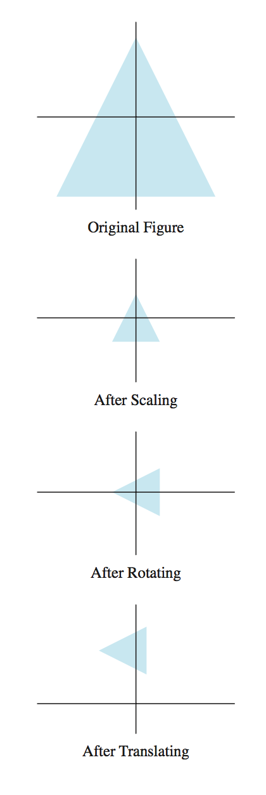

<h1>
Linear Algebra Review VII
</h1>
-   Candice Schumann
-   August 18, 2016

## 2.7 Applications to Computer Graphics

We can use mathematics to manipulate and display graphical images.

The Letter N in this case is a collection of vertices connected by straight line segments. We can transform N by using a matrix A.

### Homogeneous Coordinates

Each point (*x*,*y*) in  can be identified with the point (*x*,*y*,1) on the plane in  that lies one unit above the *xy*-plane. Homogeneous coordinated are not added or multiplied by scalars, they can be transformed via multiplication by 3x3 matrices.

#### 3D Coordinated

In general (*X*,*Y*,*Z*,*H*) are homogeneous coordinates for (*x*,*y*,*z*) if  and

<!--- x=\frac{X}{H},\ y=\frac{Y}{H},\ \text{and } z=\frac{Z}{H} -->

### Composite Transformations

When moving an image you will probably require two or more transformations

#### 3D Computer Graphics Applications
 - 3D protein visualization
 - Virtual reality molecular modeling
 - Detecting head, hand, and finger movements in virtual reality

### Perspective Projections
A three-dimensional object is represented on the two-dimensional computer screen by projecting the object onto a viewing plane.
A perspective projection maps each point (*x*,*y*,*z*) onto an image point (*x*\*,*y*\*,0) so that the two points and the eye position, called the center of projection (0,0,*d*) are on a line.

<!--- x*=\frac{x}{1-z/d} -->

<!--- y*=\frac{y}{1-z/d} -->

<!--- (x,y,z,1)\text{ maps onto }\left(\frac{x}{1-z/d},\frac{y}{1-z/d},0,1\right) -->

## Partial Correlation
"Partial correlation measures the degree of association between two random variables, with the effect of a set of controlling random variables removed"

If we have the following correlation matrix:

<!--- (Show correlation matrix from http://www.statsdirect.com/help/default.htm#regression_and_correlation/partial_correlation.htm) -->

We can calculate the partial correlation of AB while taking into account C

<!--- (Show partial of AB adjusted for C from Stats Help) -->

The geometric interpretation of partial correlation:

<!--- (Show geometrical interpretation of partial correlation from https://en.wikipedia.org/wiki/Partial_correlation#Using_matrix_inversion) -->

###Matrix inversion
In  we can calculate all partial correlations using matrix inversion. The only requirement is that the correlation matrix (or covariance matrix) must be positive definite (and therefore invertible)

<!--- \mathbf{P}=\mathbf{\Omega}^{-1} -->

#### Positive definite
A matrix is positive definite if it is symmetric and all of its eigenvalues are positive.