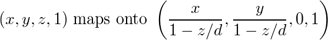

<h1>
Linear Algebra Review VII
</h1>
-   Candice Schumann
-   August 18, 2016

## 2.7 Applications to Computer Graphics

We can use mathematics to manipulate and display graphical images.

(insert example of N here)
(insert matrix of N)

The Letter N in this case is a collection of vertices connected by straight line segments. We can transform N by using a matrix A.

(insert matrix AN)
(insert example of N transformed)

### Homogeneous Coordinates

Each point (*x*,*y*) in <!-- \mathbb{R}^2 -->  can be identified with the point (*x*,*y*,1) on the plane in \mathbb{R}^3 that lies one unit above the *xy*-plane. Homogeneous coordinated are not added or multiplied by scalars, they can be transformed via multiplication by 3x3 matrices.

#### 3D Coordinated

In general (*X*,*Y*,*Z*,*H*) are homogeneous coordinates for (*x*,*y*,*z*) if H\neq0 and

<!-- x=\frac{X}{H},\ y=\frac{Y}{H},\ \text{and } z=\frac{Z}{H} -->

### Composite Transformations

When moving an image you will probably require two or more transformations

(insert triangle example)

#### 3D Computer Graphics Applications
 - 3D protein visualization
 - Virtual reality molecular modeling
 - Detecting head, hand, and finger movements in virtual reality

### Perspective Projections
A three-dimensional object is represented on the two-dimensional computer screen by projecting the object onto a viewing plane.
A perspective projection maps each point (*x*,*y*,*z*) onto an image point (*x*\*,*y*\*,0) so that the two points and the eye position, called the center of projection (0,0,*d*) are on a line.

(Insert projection example)

<!-- x*=\frac{x}{1-z/d} -->

<!-- y*=\frac{y}{1-z/d} -->

<!-- (x,y,z,1)\text{ maps onto }\left(\frac{x}{1-z/d},\frac{y}{1-z/d},0,1\right) -->
