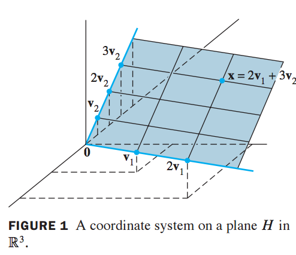

<h1>
Linear Algebra Review IX
</h1>
-   Jonathan Goodson
-   August 23, 2016

## 2.8 Subspaces of ℝn 

### Subspaces

Apparently this is an important section that covers most of chapters 3 and 4. I'm sorry for what is about to happen.

First, the definition of a **subspace**.

A **subspace** of ℝn  is any set *H* in ℝn that has three properties:

* The zero vector is in *H*.
* For each **u** and **v** in *H*, the sum **u** + **v** is in *H*.
* For each **u** in *H* and each scalar *c*, the vectur *c* **u** is in *H*.

As a trivial example, the span of two vectors in ℝn is a subspace of ℝn. Subspaces may be as simple as a the zero vector or a  line through the origin, or more complicated such as a plane or higher dimensional shapes through the origin.

Additional concepts in subspaces:

The **column space** of a matrix is the set of all linear combinations of the columns of the matrix. (Conceptually the same as the span of all vectors included in the matrix) This allows one to check if a vector **b** is in the column space of the matrix by asking if it is a solution to the matrix equation *A***x**=**b**.

The **null space** of a matrix is the set of all solutions to the equation *A***x**=**0**.

### Basis for a subspace

Subspaces contain an infinite number of vectors (except the zero subspace, and maybe something else?), and infinity is inconvenient.

A **basis** for a subspace is a set of linearly independent vectors that span the subspace. (The minimal number of vectors required to span the subspace)

The columns of the identity matrix *I*n are the basis of ℝn.

Basis of a null space:

Solving the equation *A***x**=**0** and writing the solution set in parametric vector form results in vectors who span the null space.

Basis of the column space of a matrix:

The pivot columns of a matrix form the basis! Easy! **HOWEVER** the pivot columns of the matrix are the basis, NOT the columns of an echelon form. (Honestly I haven't figured out this part yet someone help me.)

## 2.9 Dimension and Rank

This section introduces the concept of a *dimension* defining a coordinate system. 

Definitions:

Given a set of vectors which are a basis of a subspace *H*, for any vector **x** in *H*, the **coordinates of x relative to the basis* as the scalar weights such that **x** = *c*1**b**1 + ... + *c*p**b**p.

Given the same set of vectors making up the basis. 

is the **coordinate vector of x** relative to the basis.

I really like the following visualization.

The coordinate vector represents the position on each vector making up the basis which is required to generate the vector at those coordinates. The coordinate vector must be of the same length as the number of vectors making up the subspace (the number of dimensions).

The **dimension* of a nonzero subspace *H*, is the number of vectors in a basis for *H*.

Extra terms, the **rank** of a matrix is the dimension of the column space of the matrix.

Extra theorem: If a matrix has *n* columns, then rank + dimension of the null space = *n*. This occurs because the rank is the number of pivot columns, and the dimension of the null space corresponds to the number of free variables in the solution.

Extra theorem: If *H* is a *p*-dimensional subspace, then all linearly independent sets of *p* elements in *H* are a basis for *H*. Correspondingly, any set of *p* elements that span *H* are a basis.

Additions to the invertible matrix theorem:

If *A* is an *n* x *n* matrix, all the following are equivalent to saying *A* is invertible:

* The columns of *A* form a basis of ℝn 
* Col *A* = ℝn 
* dim Col *A* = *n*
* rank *A* = *n*
* Nul *A* = {**0**}
* dim Nul *A* = 0