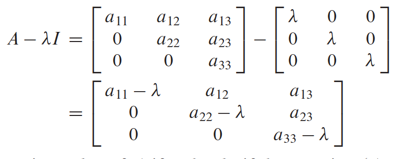

---
output:
  html_document:
    toc: yes
  md_document:
    md_extensions: +tex_math_dollars
    pandoc_args: --webtex
    toc: yes
    toc_depth: 2
    variant: markdown_github
  pdf_document:
    toc: yes
    toc_depth: '2'
---

```{r include=FALSE}
library(knitcitations)
library(knitr)
opts_chunk$set(fig.path='img/',
               fig.width=1080/120,
               fig.height=1080/120,
               dpi=120, fig.retina=2)
```

<h1>Linear Algebra Review X</h1>

- Nate Olson
- August 25, 2016

Section 5.1 Eigenvectors and Eigenvalues

## Definitions

- __eigenvector__ - nonzero vector such that $A\mathbf{x}=\lambda\mathbf{x}$ for a scalar $\lambda$.  
- __eigenvalue__ - the scalar $\lambda$, for the eigenvector $\mathbf{x}$.   
- __eigenspace__ - the subspace of ${\rm I\!R}^n$ defined by set of all solutions of $(A - \lambda I)\mathbf{x}=0$ for $A$ and $\lambda$.  

## Eigens from another perspective
[khanacademy eigenvalues and eigenvector video](https://www.khanacademy.org/math/linear-algebra/alternate-bases/eigen-everything/v/linear-algebra-introduction-to-eigenvalues-and-eigenvectors)

- Eigenvector ($\mathbf{x}$) is a vector scaled ($\lambda$) by a transformation, $T(\mathbf{x})=\lambda\mathbf{x}$, where transformation $T$ is $\mathbf{A}$.  
- The transformed vectors make for better basis vectors, make for simpler computations or good coordinate systems.

<p><a href="https://commons.wikimedia.org/wiki/File:Eigenvalue_equation.svg#/media/File:Eigenvalue_equation.svg"></a><br>By Lyudmil Antonov <a href="//commons.wikimedia.org/wiki/User:Lantonov" title="User:Lantonov">Lantonov</a> 16:35, 13 March 2008 (UTC) - <a href="//commons.wikimedia.org/wiki/File:Inkscape_Logo.svg" title="File:Inkscape Logo.svg"></a>
This <a href="https://en.wikipedia.org/wiki/Vector_images" class="extiw" title="w:Vector images">vector image</a> was created with <a href="//commons.wikimedia.org/wiki/Help:Inkscape" title="Help:Inkscape">Inkscape</a>., <a href="http://www.gnu.org/copyleft/fdl.html" title="GNU Free Documentation License">GFDL</a>, <a href="https://commons.wikimedia.org/w/index.php?curid=3698599">https://commons.wikimedia.org/w/index.php?curid=3698599</a></p>

## Finding Eigenvalues, Eigenvectors, and Eigenspace

- Vector $\mathbf{x}$ is an eigenvector of $\mathbf{A}$ if the resulting vector is a scalar multiple of $\mathbf{x}$. The scalar $\lambda$ is the eigenvalue.  
- $\lambda$ is an eigenvalue of $\mathbf{A}$ if the columns in $(A -\lambda I)$ are linearly dependent, e.g. has a nontrivial solution.  
- Basis of an eigenspace is $(A - 2 I)\mathbf{x}=\mathbf{0}$, find by row reduction of the augmented matrix.

## Theorem 1
_The eigenvalues of a triangular matrix are the entries on its main diagonal._  
Key idea is that $(A- \lambda I)\mathbf{x}=0$, therefore at least one entry on the diagonal of $A-\lambda I$ is zero.



## Theorem 2
If $\mathbf{v}_1, \dots, \mathbf{v}_r$ are eigenvectors that correspond to distince eigenvalues, $\lambda_1, \dots, \lambda_r$ of an $n \times n$ matrix $A$, then the set $\{\mathbf{v}_1, \dots, \mathbf{v}_r\}$ is linearly independent.

## Other points of interest

- 0 is an eigenvalue of $A$ if and only if $A$ is not invertible. 


## Additional Eignevalue Propertives
from [Wikipedia](https://en.wikipedia.org/wiki/Eigenvalues_and_eigenvectors)

- determinant is equal to the product of the eigenvalues

# References
[Lay - Linear Algebra and its
Applications](http://www.laylinalgebra.com/)