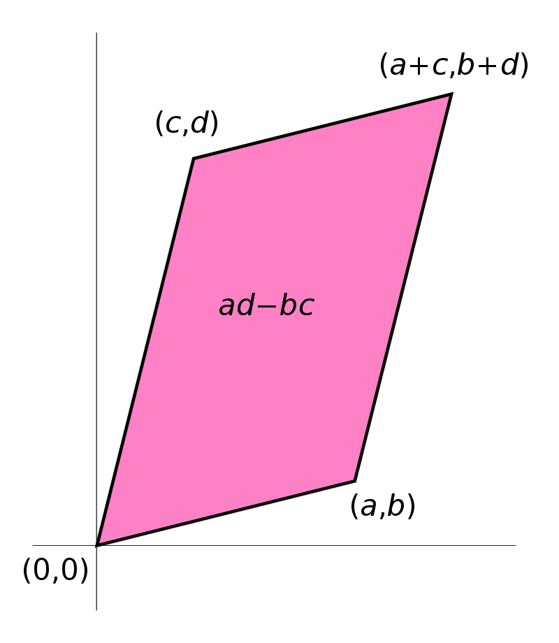
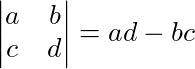

---
output:
  html_document:
    toc: true
  md_document:
    variant: markdown_github
    md_extensions: +tex_math_dollars
    pandoc_args: ['--webtex']
    toc: true
    toc_depth: 2
---

```{r include=FALSE}
library(knitr)
opts_chunk$set(fig.path='img/',
               fig.width=1080/120,
               fig.height=1080/120,
               dpi=120, fig.retina=2)
```

<h1>Linear Algebra Review XI</h1>

- Keith Hughitt
- Sept 02, 2016

Determinants
============

### Some geometric motivation

A $2 \times 2$ matrix, $A$, can be viewed as a **linear map** which transforms
the **standard basis vectors** (unit vectors pointing in the direction of the
coordinate exes, in this case $e_x = (1,0)$ and $e_y = (0, 1)$) to the rows (or
columns) of $A$.

The image of the basis vectors form a parallelogram representing the
transformation applied to the unit square:



(source: [Wikipedia](https://en.wikipedia.org/wiki/Determinant#/media/File:Area_parallellogram_as_determinant.svg))

> The parallelogram defined by the rows of the above matrix is the one with
> vertices at (0, 0), (a, b), (a + c, b + d), and (c, d), as shown in the
> accompanying diagram. -Wikipedia

And:

**The absolute value of ad − bc is the area of the parallelogram, and thus
represents the scale factor by which areas are transformed by A.** -Wikipedia

....This is the definition of the determinant ($\Delta$) of a $2 \times 2$ matrix:



The same idea can be extended into higher dimensions, for example, the absolute
value of the determinant of a $3 \times 3$ matrix is the volume of the
**parallelepiped** bound by coordinates related to values from the original matrix.

Here, the parallelepiped represents the transformed **unit cube**.

Another useful way of thinking of the determinant geometrically:

> You can derive the algebraic properties from this geometrical interpretation.
> For example, if two of the columns are linearly dependent, your box is
> missing a dimension and so it's been flattened to have zero volume. [2]

### Other useful theorems we missed in chapter 3...

- **Theorem 2** If $A$ is a triangular matrix, then det $A$ is the product of
  the entries on the main diagonal of $A$.
    - This is easy to see for $2 \times 2$ example: second product includes
      something below the diagonal so it goes to zero, leaving only the product
      coming from the diagonal.
- **Theorem 3**: Determinant for one square matrix can be determined by
  following simple rules relating to row operations used to get from that
  matrix to a new one (see p192 for details).
- Relation to invertibility of a matrix:
    1. When $A$ is invertible: det $A = (-1)^r \times (\text{product of pivots in} U)$
    2. When $A$ is _not_ invertible, det $A = 0$
- **Theorem 4** A square matrix $A$ is invertible iff det $A \neq 0$
    - The columns of $A$ are linearly dependent $\implies det A = 0$
        - ...remember the geometric interpretation of this idea above.
    - The rows of $A$ are linearly dependent $\implies det A = 0$
        - Rows of $A$ = columns of $A^T$.
        - When $A^T$ is singular, so is $A$.
- **Theorem 5** If $A$ is an $n \times n$ matrix, then $\text{det} A^T = \text{det} A$.
- **Theorem 6** If $A$ and $B$ are $n \times n$ matrices, then det $A B$ =
  (det $A$)(det $B$).
  - Note: this is _not_ true for sums of determinants!

Skipping 3.3 on Cramer's Rule, etc. (too much typing and not really needed
below..)

The Characteristic Equation
===========================

For a given square matrix, $A$, recall that eigenvalues for the matrix are
defined as:

$$
Ax = \lamba x
$$

We can then rearrange this to:

$$
(A - \lamba I)x = 0
$$

to find the eigenvalues associated with a given matrix. All values for
$\lambda$ that lead to a nontrival solution for the above equation are
the eigenvalues for the matrix.

Next, recall that for a matrix to be invertible, equation $Ax = 0$ must have
_only_ the trivial solution (IVT).

Therefore, another way to think about the above problem is to look for all
$\lambda$ such that $A - \lambdaI$ is _not_ invertible.

From Lay 3.2, theorem 4 states:

> A square matrix A is invertible iff det A != 0

Which leads us to the following way of determining the eigenvalues for $A$:

$$
det(A - \lambda I) = 0
$$


Spectral analysis of covariance matrices
========================================

First, we will create a vector with three columns, one of which is a multiple
of another.

```{r eigenvector_example}
set.seed(1)

dat <- matrix(rnorm(40), ncol=2)
dat <- cbind(1.0 * dat[,1], dat)

pairs(dat, upper.panel=NULL)

```

Next, we will take compute the _square_ covariance matrix corresponding to our original 
_rectangular_ data matrix.

Because of the linear dependence in the columns of `dat`, there are only two
non-zero eigenvalues.

```{r}
# get the (square) covariance matrix for our data
covmat <- cov(dat)

# compute the eigenvectors / eigenvalues of the covariance matrix
eigen(covmat, symmetric=TRUE)
```

In the output, the `$vectors` components is a $p \times p$ matrix whose
_columns_ contain the eigen vectors of the input matrix, normalized to unit
length (see `?eigen`).

Notice that the first two _rows_ in the result matrix are the same, but
pointing in opposite directions. What do the rows mean in this context?..

What happens if we add another column that is a multiple of the first one?

```{r}
dat2 <- cbind(2 * dat[,1], dat)
eigen(cov(dat2), symmetric=TRUE)
```

p.s. Nice quote from Lay in the opening of chapter 3:

> In Cauchy's day, when life was simple and matrices were small...

References
==========

1. https://en.wikipedia.org/wiki/Determinant

2. http://math.stackexchange.com/questions/668/whats-an-intuitive-way-to-think-about-the-determinant
