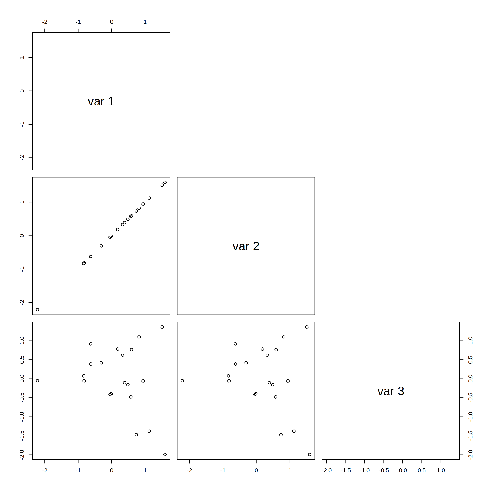

-   [Determinants](#determinants)
    -   [Some geometric motivation](#some-geometric-motivation)
    -   [Other useful theorems we missed in chapter 3...](#other-useful-theorems-we-missed-in-chapter-3...)
-   [The Characteristic Equation](#the-characteristic-equation)
    -   [Overview](#overview)
    -   [Characteristic polynomials](#characteristic-polynomials)
    -   [Similarity](#similarity)
-   [Diagonalization](#diagonalization)
    -   [Overview](#overview-1)
    -   [The Diagonalization Theorem](#the-diagonalization-theorem)
-   [Tangent: spectral analysis of covariance matrices](#tangent-spectral-analysis-of-covariance-matrices)
    -   [Matrices with correlated features](#matrices-with-correlated-features)
-   [References](#references)

<h1>
Linear Algebra Review XI
</h1>
-   Keith Hughitt
-   Sept 02, 2016

Determinants
============

Some geometric motivation
-------------------------

### 2x2 matrices

A  matrix, , can be viewed as a **linear map** which transforms the **standard basis vectors** (unit vectors pointing in the direction of the coordinate exes, in this case ") and ")) to the rows (or columns) of .

The image of the basis vectors form a parallelogram representing the transformation applied to the unit square:


(source: [Wikipedia](https://en.wikipedia.org/wiki/Determinant#/media/File:Area_parallellogram_as_determinant.svg))

> The parallelogram defined by the rows of the above matrix is the one with vertices at (0, 0), (a, b), (a + c, b + d), and (c, d), as shown in the accompanying diagram. -Wikipedia

And:

**The absolute value of ad − bc is the area of the parallelogram, and thus represents the scale factor by which areas are transformed by A.** -Wikipedia

....This is the definition of the determinant () of a  matrix:


### 3x3 matrices

The same idea can be extended into higher dimensions, for example, the absolute value of the determinant of a  matrix is the volume of the **parallelepiped** bound by coordinates related to values from the original matrix.


(source: [Wikipedia](https://en.wikipedia.org/wiki/Determinant#/media/File:Determinant_parallelepiped.svg))

Here, the parallelepiped represents the transformed **unit cube**.

### Related geometric interpretation

Another useful way of thinking of the determinant geometrically:

> You can derive the algebraic properties from this geometrical interpretation. For example, if two of the columns are linearly dependent, your box is missing a dimension and so it's been flattened to have zero volume. \[2\]

### Determinants of correlation matrices

For example, suppose we are looking at *correlation matrices* for two variables.

In the first scenario, suppose the variables are highly correlated. In this case, the parallelogram corresponding to the matrix would be thin, and therefor, have a small area:

``` r
set.seed(1)

x <- 1:5
y <- x + rnorm(5)
mat <- cbind(x, y)

cor_mat1 <- cor(mat)
cor_mat1
```

    ##          x        y
    ## x 1.000000 0.934176
    ## y 0.934176 1.000000

``` r
# components of mat
a1 <- cor_mat1[1,1]
b1 <- cor_mat1[2,1]
c1 <- cor_mat1[1,2]
d1 <- cor_mat1[2,2]

plot(c(0, 2), c(0, 2), type = "n")
polygon(c(0, a1, a1 + c1, c1), c(0, b1, b1 + d1, d1), col='#369bed')
```


``` r
det(cor_mat1)
```

    ## [1] 0.1273151

``` r
eigen(cor_mat1)
```

    ## $values
    ## [1] 1.93417604 0.06582396
    ## 
    ## $vectors
    ##           [,1]       [,2]
    ## [1,] 0.7071068 -0.7071068
    ## [2,] 0.7071068  0.7071068

Next, suppose we have to completely uncorrelated variables; here, the parallelogram would be much closer to the unit square and its area would close to 1:

``` r
x <- rnorm(100)
y <- rnorm(100)
mat <- cbind(x, y)

cor_mat2 <- cor(mat)
cor_mat2
```

    ##             x           y
    ## x  1.00000000 -0.02049706
    ## y -0.02049706  1.00000000

``` r
# components of mat
a2 <- cor_mat2[1,1]
b2 <- cor_mat2[2,1]
c2 <- cor_mat2[1,2]
d2 <- cor_mat2[2,2]

plot(c(0, 2), c(0, 2), type = "n")
polygon(c(0, a2, a2 + c2, c2), c(0, b2, b2 + d2, d2), col='#369bed')
```


``` r
det(cor_mat2)
```

    ## [1] 0.9995799

``` r
eigen(cor_mat2)
```

    ## $values
    ## [1] 1.0204971 0.9795029
    ## 
    ## $vectors
    ##            [,1]       [,2]
    ## [1,] -0.7071068 -0.7071068
    ## [2,]  0.7071068 -0.7071068

<span style="color:red;">**QUESTION**:</span> *Why are the values of the eigenvectors so similar for the two examples?..*

The same basic trends hold true when applied to covariance matrices as well (correlated variables lead to closer values in the covariance matrix), however the exact values of the coordinates and the determinant change.

Other useful theorems we missed in chapter 3...
-----------------------------------------------

-   **Theorem 2** If  is a triangular matrix, then det  is the product of the entries on the main diagonal of .
    -   This is easy to see for  example: second product includes something below the diagonal so it goes to zero, leaving only the product coming from the diagonal.
-   **Theorem 3**: Determinant for one square matrix can be determined by following simple rules relating to row operations used to get from that matrix to a new one (see p192 for details).
-   Relation to invertibility of a matrix:
    1.  When  is invertible: det ^r \times (\text{product of pivots in } U)")
    2.  When  is *not* invertible, det 
-   **Theorem 4** A square matrix  is invertible if and only if det 
    -   The columns of  are linearly dependent 
        -   ...remember the geometric interpretation of this idea above.
    -   The rows of  are linearly dependent 
        -   Rows of  = columns of .
        -   When  is singular, so is .
-   **Theorem 5** If  is an  matrix, then .
-   **Theorem 6** If  and  are  matrices, then det  = (det )(det ).
-   Note: this is *not* true for sums of determinants!

Skipping 3.3 on Cramer's Rule, etc. (too much typing and not really needed below..)

The Characteristic Equation
===========================

Overview
--------

**Main idea:**

Information about the <i>eigenvalues</i> of a square matrix are encoded in a special equation called the <b>characteristic equation</b> of the matrix.

For a given square matrix, , recall that eigenvalues for the matrix are defined as:

*A**x* = *λ**x*

We can then rearrange this to:

(*A* − *λ**I*)*x* = 0

to find the eigenvalues associated with a given matrix. All values for  that lead to a nontrival solution for the above equation are the eigenvalues for the matrix.

Next, recall that for a matrix to be invertible, equation  must have *only* the trivial solution (IVT).

Therefore, another way to think about the above problem is to look for all  such that  is *not* invertible.

From Lay 3.2, theorem 4 states:

> A square matrix A is invertible if and only if det A != 0

Which leads us to the following way of determining the eigenvalues for :

*d**e**t*(*A* − *λ**I*)=0

This is called the **The Characteristic Equation** of . Any scalar  is an eigenvalue of  if and only if it satisfies the above equation.

When we have a triangular matrix, we can just take the product each of the diagonal values - , and set it equal to zero.

After expansion, this leaves us with a simple polynomial equation in a single variable!

Characteristic polynomials
--------------------------

-   If  is an  matrix, then det (  )is a polynomial of degree  called the <b>characteristic polynomial</b> of .
-   To find the eigenvalues for , we simply find the roots of its characteristic polynomial equation!

Similarity
----------

Another key idea from 5.2 which leads us into the chapter on matrix diagonalization is *similarity*.

-   If  and  are  matrices, then  *is similar to*  if there is an invertible matrix  such that .
-    *is similar to*  implies  *is similar to* 
-   Changing  into  is called a **similarity transformation**

If  matrices  and  are similar, then they have the same characteristic polynomial and hence the same eigenvalues (with the same multiplicities).

-note: *similarity*  *row equivalence*.

Diagonalization
===============

Overview
--------

**Main idea:**

The eigenvalue-eigenvector information contained within a matrix  can be displayed in a usefu factorization of the form , where:

-   P -&gt; eigenvectors
-   D -&gt; eigenvalues

-    stands for *diagonal*
-   Useful for computing  for large values of 
-   Aka "Eigendecomposition" or "spectral decomposition"
-   [SVD](https://en.wikipedia.org/wiki/Singular_value_decomposition) extends this idea to rectangular matrices.

The Diagonalization Theorem
---------------------------

-   A square matrix  is said to be **diagonalizable** if  is similar to a diagonal matrix, i.e. if  for some invertible matrix  and some diagonal matrix .

**Theorem 5**

> An  matrix  is diagonalizable if and only if  has  linearly indepdendent eigenvectors. In fact, , with  a diagonal matrix, if and only if the columns of  are  linearly independent eigenvectors of . In this case, the diagonal entries of  are eigenvalues of  that correspond, respectively, to the eigenvectors in . (Lay 5.3)

In other words...

-** is diagonalizable if and only if there are enough eigenvectors to form a basis of . - We call such a basis an **eigenvector basis\*\*.

Tangent: spectral analysis of covariance matrices
=================================================

To get a better feel for what the eigenvalues and eigenvectors of covariance matrices look like, let's look at a couple examples using fake data.

Matrices with correlated features
---------------------------------

### 3 variables (2 correlated)

First, we will create a vector with three columns, one of which is a multiple of another.

``` r
set.seed(1)

dat <- matrix(rnorm(40), ncol=2)
dat <- cbind(1.0 * dat[,1], dat)

# visualization relationship between the columns
cor(dat)
```

    ##            [,1]       [,2]       [,3]
    ## [1,]  1.0000000  1.0000000 -0.2175249
    ## [2,]  1.0000000  1.0000000 -0.2175249
    ## [3,] -0.2175249 -0.2175249  1.0000000

``` r
pairs(dat, upper.panel=NULL)
```



Next, we will take compute the *square* covariance matrix corresponding to our original *rectangular* data matrix.

Because of the linear dependence in the columns of `dat`, there are only two non-zero eigenvalues.

``` r
# get the (square) covariance matrix for our data
covmat <- cov(dat)

# compute the eigenvectors / eigenvalues of the covariance matrix
eigen(covmat, symmetric=TRUE)
```

    ## $values
    ## [1]  1.729812e+00  6.975298e-01 -2.220446e-16
    ## 
    ## $vectors
    ##            [,1]      [,2]          [,3]
    ## [1,] -0.6856324 0.1729401  7.071068e-01
    ## [2,] -0.6856324 0.1729401 -7.071068e-01
    ## [3,]  0.2445742 0.9696306  6.383782e-16

In the output, the `$vectors` components is a  matrix whose *columns* contain the eigen vectors of the input matrix, normalized to unit length (see `?eigen`).

Notice that the first two *rows* in the result matrix are the same, but pointing in opposite directions. What do the rows mean in this context?..

### 4 variables (3 correlated)

What happens if we add another column that is a multiple of the first one?

``` r
dat2 <- cbind(2 * dat[,1], dat)
cor(dat2)
```

    ##            [,1]       [,2]       [,3]       [,4]
    ## [1,]  1.0000000  1.0000000  1.0000000 -0.2175249
    ## [2,]  1.0000000  1.0000000  1.0000000 -0.2175249
    ## [3,]  1.0000000  1.0000000  1.0000000 -0.2175249
    ## [4,] -0.2175249 -0.2175249 -0.2175249  1.0000000

``` r
eigen(cov(dat2), symmetric=TRUE)
```

    ## $values
    ## [1]  5.046133e+00  7.173388e-01  5.642840e-16 -2.493860e-16
    ## 
    ## $vectors
    ##             [,1]        [,2]          [,3]          [,4]
    ## [1,]  0.81253173 -0.08036699  4.807996e-01  3.196327e-01
    ## [2,]  0.40626587 -0.04018350 -8.722681e-01  2.692241e-01
    ## [3,]  0.40626587 -0.04018350 -8.933102e-02 -9.084896e-01
    ## [4,] -0.09842906 -0.99514407 -1.942890e-16 -2.463307e-16

p.s. Nice quote from Lay in the opening of chapter 3:

> In Cauchy's day, when life was simple and matrices were small...

References
==========

1.  *Lay* chapter 5.2 - 5.3
2.  <https://en.wikipedia.org/wiki/Determinant>
3.  <http://math.stackexchange.com/questions/668/whats-an-intuitive-way-to-think-about-the-determinant>
