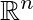

# Linear Algebra Review XII

-   Candice Schumann
-   August 31, 2016

## Inner Product

 is the inner product (or dot product)

### Theorem 1

## Norm

The norm of a vector is the length of a vector

### Unit vector

To create a unit vector divide a vector by its norm. The length of any unit vector is 1. Create unit vectors to normalize data.

## Distances in 

## Orthogonal Vectors

Two vectors are geometrically perpendicular iff 

### Definition

Two vectors **u** and **v** in  are orthogonal (to each other) if 

**0** vector is orthogonal to every vector in 

### Pythagorean Theorem

Two vectors **u** and **v** are orthogonal iff 

## Orthogonal Complements

If a vector **z** is orthogonal to every vector in a subspace *W* of , then **z** is said to be orthogonal to *W*. The set of all vectors **z** that are orthogonal to *W* is called the orthogonal complement of *W* and is donated by 

1) A vector **x** is in  iff **x** is orthogonal to every vector in a set that spans *W*.
2)  is a subspace of 

### Theorem 3

