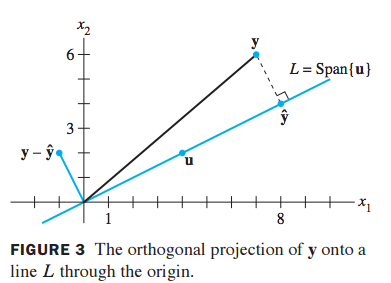
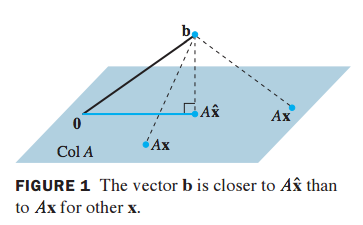

<h1>
Linear Algebra Review IX
</h1>
-   Jonathan Goodson
-   September 12, 2016

## 6.2 Orthogonal Sets 

### Orthogonal sets

A set of vectors are an **orthogonal set** if each pair of distint vectors in the set is orthogonal. **u**i•**u**y=0 whenever *i*≠*j*.

Theorem 4:

If *S* = {**u**1m ..., **u**p} is an orthogonal set of nonzero vectors in ℝn, then *S* is linearly independent and hence is a basis for the subspace spanned by *S*.

An **orthogonal basis** for a subspace *W* of ℝn is a basis for *W* that is also an orthogonal set.

Theorem 5:

Let {**u**1m ..., **u**p} be an orthogonal basis for a subspace *W* of ℝn. For each **y** in *W*, the weights in the linear combination

	**y** = *c*1**u**1 + ... + *c*p**u**p
	
are given by

	*c*j = **y**•**u**j / **u**j•**u**j
	where *j* = 1, ..., *p*
	
This allows one to easily calculate the weights for an arbitrary vector in the subspace spanned by the orthogonal set as a linear combination of the orthogonal vectors without having to solve the complete system of equations.

### An Orthogonal Projection

An orthogonal projection involves decomposing a vector **y** into two orthogonal vectors, one of which is a multiple of **y**.

	**y** = **ŷ** + **z**
	
	where **ŷ** = α**u** and **z** is orthogonal to **u**
	
The vector **ŷ** is the **orthogonal projection of y onto u** and the vector **z** is the **component of y orthogonal to u**.

Sometimes **ŷ** is represented by projL**y** and called the **orthogonal projection of y onto** *L*, where *L* is the line spanned by **y**.

**ŷ** is the point on *L* that is *closest* to **y**. 

### Orthonormal sets

An **orthonormal set** is an orthogonal set where all vectors are of unit length. If *W* is the subspace spanned by this set, this the set is an **orthonormal basis** for the subspace *W*.

An **orthogonal set** can be made into an **orthonormal set** by *normalizing* the vector lengths, and the set remains orthogonal.

Theorem 6:

An *m* x *n* matrix *U* has orthonormal columns if and only if *U*T*U* = *I*.

This is proved by doing the matrix multiplication and utilizing the definition of an orthogonal set.

Theorem 7:

Let *U* be an *m* x *n* matrix with orthonormal columns, and let *x* and *y* be in ℝn. Then

	a. ||*U***x**|| = ||**x**||
	b. (*U***x**)•(*U***y**) = **x**•**y**
	c. (*U***x**)•(*U***y**) = 0 if and only if **x**•**y** = 0