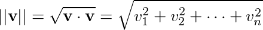

-   [Least-squares Problems](#least-squares-problems)
    -   [Overview](#overview)
-   [References](#references)

<h1>
Linear Algebra Review XIV
</h1>
-   Keith Hughitt
-   Sept 19, 2016

Least-squares Problems
======================

Overview
--------

So far, much of the linear algebra discussion has been focused on matrices which could be used to represent *consistent* systems of linear equations, i.e. ones which have solutions.

In these cases, there exists one or more values for  such that .

Here, we discuss how to deal with systems for which there is *no valid solutions* to the matrix equation . Instead, we will seek to find an  that is "close" to a solution, in fact, one that is as close as we can get.

In this scenario,  can be thought of as an *approximation* to .

### General least-squares problem

The **General least-squares problem** is to find an  that makes  as small as possible. \[1\]

Recall that the **norm** of a vector,  is defined as:

The "squares" in "least-squares" refers to the square root of the sum of squares above.

#### Definition

*From Lay 6.5:*

If  is  and  is in , a **least-squares solution** of  is  in  such that:

$$
||\\textbf{b} - A\\hat{x}|| \\leq || \\textbf{b} - Ax||
$$

for all  in .

In the context of a data matrix:

-    = observed data values
-    = coefficient weights
-    = response / depdendent variable

And  gives us our estimate of the response variables for each row.

**Relation to Col A** (6.5, fig 1)

-   All possible 's will be in the column space of 
-   Therefor we aim to find an  such that  is the closest point in Col A to .

### Solutions of the general least-squares problem

#### Background

Using the *Best Approximate Theorem* from 6.3 (which basically says that the closest point in a subspace  to a given point in  is the projection from that point to ), we have:

$$
\\hat{b} = \\text{proj}\_{\\text{Col}A} \\textbf{b}
$$

 (source: [Wikipedia](https://en.wikipedia.org/wiki/Ordinary_least_squares#/media/File:OLS_geometric_interpretation.svg))

-    is consistent
-   Therefore, there is an  in  such that 
-   The vector  is the least-squares solution to !

In other words:

**The least-squares solution is the projection of  onto Col A.**

**Note**: If there are free variables, then there will be many solutions to this equation!

#### A simpler formulation

-   Suppose  satisfies 
-   Then by the Orthogonal Decomposition Theorem (section 6.3), we know that 
    -   Therefore,  is orthogonal to Col  (which also means it is orthogonal to each column in )
    -   ODT: Each  in  can be written uniquely as a sum of two vectors:
        1.  linear combination of some set of vectors in a subspace of  (), and,
        2.  linear combination of some set of vectors orthogonal to .
    -   Note: Compare figures 6.3 fig2 & 6.5 fig2...
-   Next, since the dot product of two orthogonal vectors equals zero, for any column  in , we have  = 0"), and
-   **DISCUSS**  = 0")
-   Since each  is a row in ,

$$
A^T(\\textbf{b} - A\\hat{x}) = 0
$$

which leads to:

$$
A^T\\textbf{b} - A^TA\\hat{x} = 0
A^TA\\hat{x} = A^T\\textbf{b}
$$

So each least-squares solution thus satisfies:

*A**T**A***x** = *A**T***b**

This equation represents a system of equations called the **normal equations** for , and solutions to this are often written as .

**Theorem 13**

The set of least-squares solution of  coincides with the nonempty set of solutions of the normal equations .

-   Example 1 goes over a simple example of finding ...
-   Steps:
    -   find 
    -   find 
    -   substitute parts back into *normal equations* formula above.
    -   To find , can use row reduction, however, in this example they use matrix inversion instead:
        -   **Section 2.2 Thm 4** (formula for finding  for 2x2 matrices using the determinant of )
        -   **Section 2.2 Thm 5** (for invertible matrices, )

**NOTE**:  need not be invertible! Example 2 provides a problem where this is not the case.

The final formulation of the general least-squares problem is the one that we are probably most familiar with, having worked with linear models previously:

**Theorem 14**

The matrix  is invertible *if and only if* the columns of  are linearly independent. In this case, the equation  has only *one* least-squares solution , and it is given by:

$$
\\hat{x} = (A^TA)^{-1}A^T \\textbf{b}
$$

The distance from  to  is called the **least-squares error**.

References
==========

1.  *Lay* chapter 6.5-6.6
2.  <https://en.wikipedia.org/wiki/Ordinary_least_squares>
