# Linear Algebra Review XV

-   Candice Schumann
-   September 21, 2016

## Applications to Linear Models

Instead of using the equation 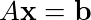 we switch to the equation 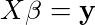 where *X* is the design matrix, 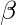 is the parameter vector, and **y** is the observation vector.

### Least Squares Lines

Want to calculate the relationship between two variables *x* and *y* in a linear equation 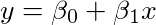. Experimental data will give you multiple *x* and *y* pairs. We want to determine the parameters that will make the line as close as possible to the experimental points. Once you have the line you have observed *y*-points from the experimental data and predicted *y*-points from the predicted line. The difference between these two points is called a residual.

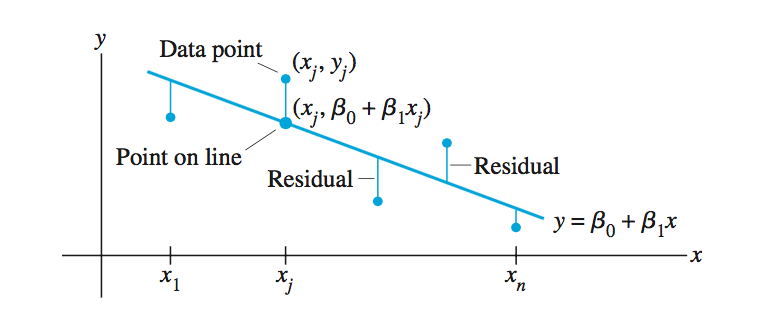

The least-squares line minimizes the sum of squares of the residuals. This is also called the line of regression of *y* on *x*. The coefficients of the line is called the regression coefficients. 

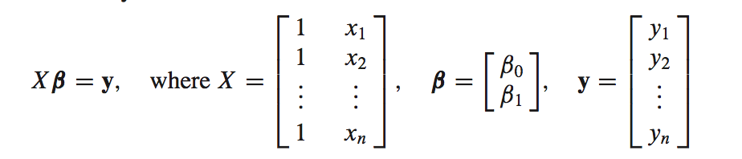

The distance between the vectors 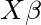 and **y** is equal to the sum of squares of the residuals. Therefore computing the solution to the least squares solution of  is the same as solving the least-sqaures line problem.

### The General Linear Model

In a GLM the form of the design matrix *X* changes from problem to problem.
A residual vector is introduced:

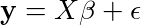

Any equation of this form is called a linear model. Once you know X and **y** the goal is to minimize the residual vector. This is the same as finding a least squares solution.

### Least-Sqaures Fitting of Other Curves

When your experimental data points do not lie on a straight line you can try to fit another functional relationship between *x* and *y*.

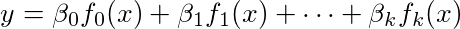

The functions are known before hand (You deside what kind of curve you want to fit based on the data). The functions are then built into the design matrix.

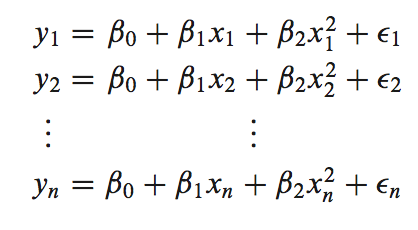

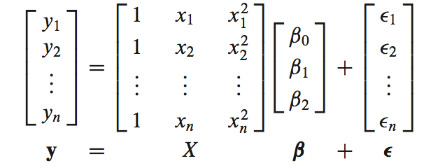

### Multiple Regression

An experiment in real life probably has more than one independent variable.

For example suppose an experiment has two independent variables *u* and *v* and one dependent variable *y*. A simple equation for predicting *y* from *u* and *v* could be:

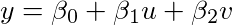

A more general prediction equation could be

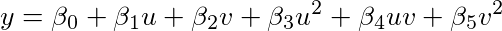