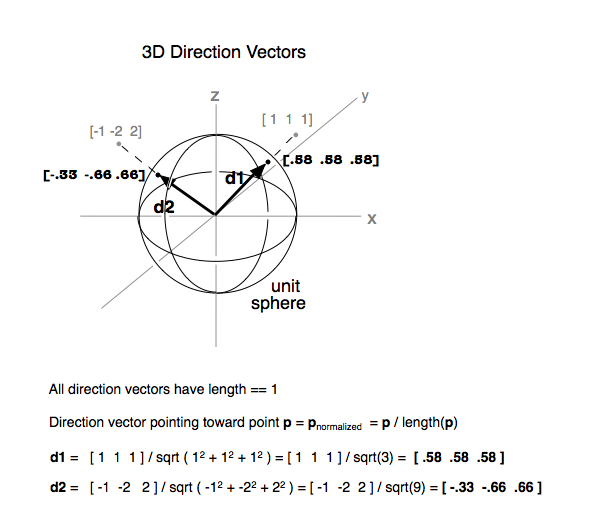

---
output:
  html_document:
    toc: true
  md_document:
    variant: markdown_github
    md_extensions: +tex_math_dollars
    pandoc_args: ['--webtex']
    toc: true
    toc_depth: 2
---

```{r include=FALSE}
library(knitr)
opts_chunk$set(fig.path='img/',
               fig.width=1080/120,
               fig.height=1080/120,
               dpi=120, fig.retina=2)
```

<h1>Linear Algebra Review XVII</h1>

- Keith Hughitt
- October 10, 2016

Review: Diagonalization
=======================

From _Lay_ section 5.3:

- A square matrix _A_ is **diagonalizable** if $A = PDP^-1$
    - In this case _A_ is said to be _similar_ to a diagonal matrix.
- An $n \times n$ matrix _A_ is diagonalizable _iff_ _A_ has _n_ linearly
  independent eigenvectors.
- **Theorem 5**: An $n \times n$ matrix _A_ is diagonalizable _iff_ _A_ has _n_
  linearly independent eigenvectors.
    - If this is the case, then:
        1. the columns of _P_ are the eigenvectors of _A_
        2. the diagonal entries of _D_ are its eigenvalues
        3. the eigenvectors of _A_ for a basis for $ℝ^n$ (An "**eigenvector
           basis**" for R^n)
- **Theorem 6**: An $n \times n$ matrix with n distinct eigenvalues is diagonalizable.
  - Note: Thm 5 was about eigenvectors, whereas this is about eigenvalues..

**QUESTION**: Can we make any statements about the number of linearly
independent _eigenvectors_ for a matrix _A_, if we know it has/does not have
linearly independent _columns_?

Review: Symmetric matrices & quadratic forms
============================================

A quick recap of what we have covered so far in _Lay_ 7.1 - 7.2:

## Symmetric matrices

- **Symmetric matrices** are those for which $A^T = A$
    - Must be _square_
- **Theorem 1**
    - If $A$ is symmetric, then any two eigenvectors from different eigenspaces
      (set of eigenvectors corresponding to a given eigenvalue + the zero
      vector) are orthogonal.
- **Theorem 2**
  - An $n \times n$ matrix $A$ is orthogonally diagonalizable _iff_ $A$ is
    symmetric.
    - **Orthogonally diagonalizable** -> there exists an orthogonal matrix $P$
      with $P^-1 = P^T$ and a diagonal matrix $D$ such that:
$$
A = PDP^T = PDP^-1
$$
    - implies that you have $n$ linearly indepedent orthonormal eigenvetors.

So, symmetric matrices can always be orthogonally diagonalized!

## Spectral Theorem

An $n \times n$ **symmetric** matrix $A$ has the following properties:

a. _A_ has _n_ real eigenvalues, counting multiplicities
b. The dimension of the eigenspace for each eigenvalue $\lambda$ equals the
multiplicity of $\lambda$ as a root of the characteristic equation.
    - Recall that the characteristic equation for an $n \times n$ matrix _A_ is
      defined as: $\text{det}(A - \lambda I) = 0$
    - And provides a way to find the eigenvalues for a matrix.
c. The eigenspaces are mutually orthogonal, in the sense that the eigenvectors
corresponding to different eigenvalues are orthogonal.
d. _A_ is orthogonally diagonalizable.

## Spectral decomposition

Provides a way to break up a symmetric matrix $A$ into pieces (rank 1 $nxn$
matrices) determined by the spectrum (eigenvalues) of _A_.

$$
A = \lambda_1 u_1 u_1^T + \lambda_2 u_2 u_2^T + ... + \lambda_n u_n u_n^T 
$$

## Quadratic forms

- A **quadratic form** on $ℝ^n$ is a function _Q_ defined on $ℝ^n$ whose value at
a vector **x** in $ℝ^n$ can be computed by an expression of the form:

$$
Q(x) = x^TAx
$$

Where _A_ is an $n \times n$ symmetric matrix.

- This can be expanded out into a polynomial, which will have cross-product
  terms whenever there are off-diagonal values in _A_.

### Change of variable in a quadratic form

- It's sometimes useful to get rid of cross-product terms associated with a
  quadratic form.
- A **change of variable** is an equation of the form:

$$
x = Py
$$

or equivalently,

$$
y = P^-1 x
$$

Where _P_ is an invertible matrix and **y** is a new variable vector in $ℝ^n$.

- **y is the coordinate vector of x relative to the basis of $ℝ^n$ determined
  by the columns of _P_**

### Principal axes

- **Theorem 4**: Let _A_ be an $n \times n$ symmetric matrix. Then there is an
  orthogonal change of variable, $x = Py$, that transforms the quadratic form
  $x^TAx$ into a quadratic form $y^TDy$ with no cross-product term.
  - i.e. **we can always get rid of cross-products for symmetric matrices**
- The columns of $P$ in the above theorem are called the **principal axes** of
  the quadratic form $x^TAx$.
- "Finding the _principal axes_ (determined by the eigenvectors of _A_) amounts
  to finding a new coordinate system with respect to which the graph is in
  standard position.

## Geometric interpretation of Principal Axes

Depending on the nature of the eigenvalues associated with a matrix, the
geometric form of the solution set to the quadratic form changes...

From [Wikipedia](https://en.wikipedia.org/wiki/Quadratic_form):

- If all eigenvalues of A are non-zero, then the solution set is an ellipsoid
  or a hyperboloid.
- If all the eigenvalues are positive, then it is an ellipsoid; if all the
  eigenvalues are negative, then it is an imaginary ellipsoid (we get the
  equation of an ellipsoid but with imaginary radii)
- If some eigenvalues are positive and some are negative, then it is a
  hyperboloid.

(See Wikipedia article for cases where one or more of the eigenvalues are 0...)

Constrained Optimization
========================

### Overview

- **Goal**: Find the min/max for a given quadratic form $Q(x)$ for _x_ in some
  specified set.
- To make this easier, we will first rearrange the problem s.t. _x_ varies over
  a set of unit vectors...

### Unit vector constraint

The above requirement that _x_ be a unit vector can be stated in several ways
including:

$$
x^T x = x_1^2 + x_2^2 + ... + x_n^2 = 1
$$


(source: [Wikipedia](https://en.wikipedia.org/wiki/Unit_vector#/media/File:3D_Direction_Vectors.tiff))

**When a quadratic form Q has no cross-product terms, it is easy to find the
maximum and minimum values of Q for $x^Tx = 1$.

**Example 1**

_Find the maximum and minimum values of:_

$$
Q(x) = 9x_1^2 + 4x_2^2 + 3x_3^2
$$

_subject to the constraint_: $x^Tx = 1$.

- Because of the unit vector constraint, we know that the maximum value for any
  of the components of x is 1.
- Since each variable is squared, we also know each term must be nonnegative.
- When thinking about maxima/minima, you want to consider the extreme cases,
  here the extreme would be if the terms with the largest/smallest coefficients
  were either 1 or 0.
- Hence the min and max values for _Q(x)_ are **3** and **9**.

**TODO**: discuss book's argumentation for solution.

> It is easy to see in Example 1 that the matrix of the quadratic form Q has eigen-
values 9, 4, and 3... 

**QUESTION**: _O Rly?..._

- For triangular matrices, there is a theorem that says that the eigenvalues
  are the entries along the diagonal.
- Since a diagonal matrix is both an _upper_ and _lower triangular_ matrix [2],
  the eigenvalues are also the diagonal values!


**Example 2**

- **elliptic paraboloid**: Quadratic form function
- **Cylinder**: Unit vector constraint ($x_1 + x_2 = 1) along the z-axis.

_p.s._ Wolfram is pretty nice here for quick plots of functions:


Crucial insight:

> Geometrically, the constrained optimization problem is to locate the
highest and lowest points on the intersection curve.

In this example, again, we see that the optima correspond to the smallest and
largest coeficients of the quadratic form function / matrix. This is because 
there are no cross-product terms.

**Theorem 6**:

- Let _m_ and _M_ be the minimum and maximum values corresponding to the closed 
range bound by the optima of the quadratic form for the symmetric matrix _A_.

- Then M is the greatest eigenvalue $\lambda_1$ of _A_ and _m_ is the least
eigenvalue of _A_. The value of $x^TAx$ is _M_ when _x_ is a unit eigenvector
$u_1$ corresponding to _M_. The value of $x^T A x$ is _m_ when _x_ is a unit
eigenvector corresponding to _m_.

(UNFINISHED...)

References
==========

1. Lay Chapters 5.1 - 5.3 and 7.1 - 7.3.
2. https://en.wikipedia.org/wiki/Triangular_matrix
3. https://en.wikipedia.org/wiki/Quadratic_form

