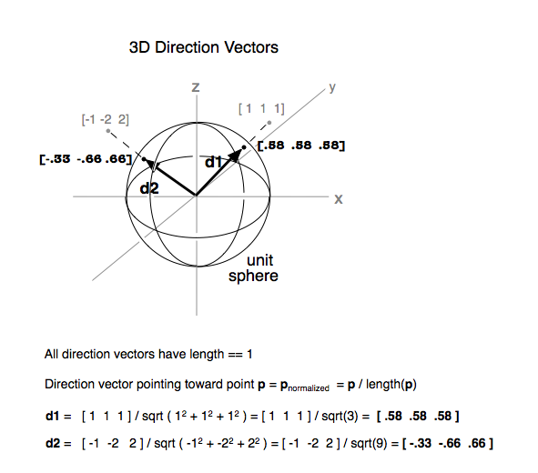
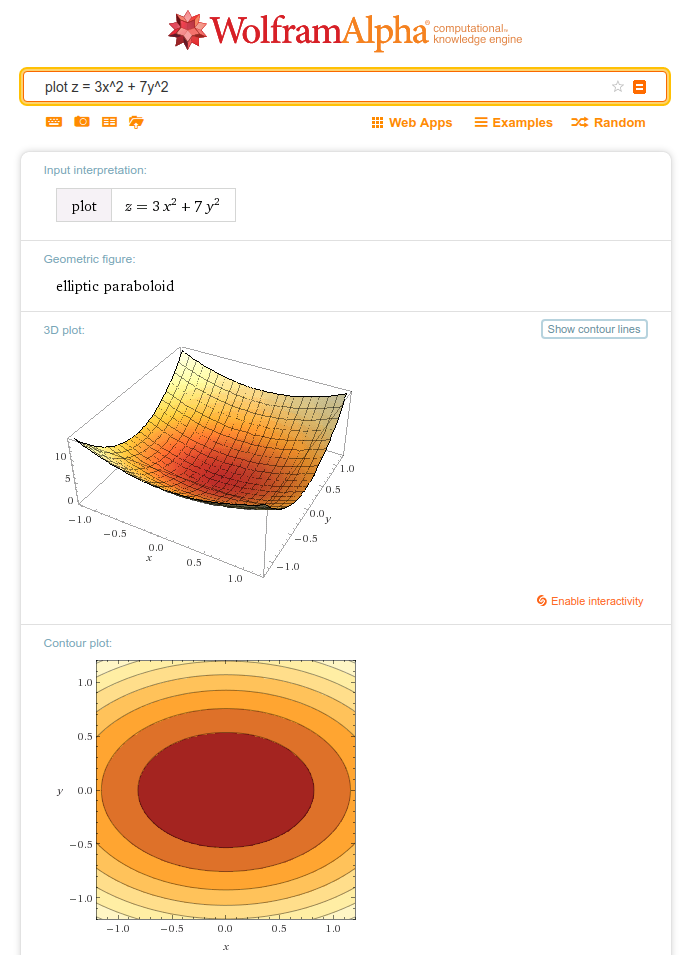

-   [Review: Diagonalization](#review-diagonalization)
-   [Review: Symmetric matrices & quadratic forms](#review-symmetric-matrices-quadratic-forms)
    -   [Symmetric matrices](#symmetric-matrices)
    -   [Spectral Theorem](#spectral-theorem)
    -   [Spectral decomposition](#spectral-decomposition)
    -   [Quadratic forms](#quadratic-forms)
    -   [Geometric interpretation of Principal Axes](#geometric-interpretation-of-principal-axes)
-   [Constrained Optimization](#constrained-optimization)
    -   [Overview](#overview)
    -   [Unit vector constraint](#unit-vector-constraint)
-   [References](#references)

<h1>
Linear Algebra Review XVII
</h1>
-   Keith Hughitt
-   October 10, 2016

Review: Diagonalization
=======================

From *Lay* section 5.3:

-   A square matrix *A* is **diagonalizable** if *A* = *P**D**P*−1
    -   In this case *A* is said to be *similar* to a diagonal matrix.
-   An *n* × *n* matrix *A* is diagonalizable *iff* *A* has *n* linearly independent eigenvectors.
-   **Theorem 5**: An *n* × *n* matrix *A* is diagonalizable *iff* *A* has *n* linearly independent eigenvectors.
    -   If this is the case, then:
        1.  the columns of *P* are the eigenvectors of *A*
        2.  the diagonal entries of *D* are its eigenvalues
        3.  the eigenvectors of *A* for a basis for *ℝ**n* (An "**eigenvector basis**" for R^n)
-   **Theorem 6**: An *n* × *n* matrix with n distinct eigenvalues is diagonalizable.
-   Note: Thm 5 was about eigenvectors, whereas this is about eigenvalues..

**QUESTION**: Can we make any statements about the number of linearly independent *eigenvectors* for a matrix *A*, if we know it has/does not have linearly independent *columns*?

Review: Symmetric matrices & quadratic forms
============================================

A quick recap of what we have covered so far in *Lay* 7.1 - 7.2:

Symmetric matrices
------------------

-   **Symmetric matrices** are those for which *A**T* = *A*
    -   Must be *square*
-   **Theorem 1**
    -   If *A* is symmetric, then any two eigenvectors from different eigenspaces (set of eigenvectors corresponding to a given eigenvalue + the zero vector) are orthogonal.
-   **Theorem 2**
-   An *n* × *n* matrix *A* is orthogonally diagonalizable *iff* *A* is symmetric.
    -   **Orthogonally diagonalizable** -&gt; there exists an orthogonal matrix *P* with *P*−1 = *P**T* and a diagonal matrix *D* such that:
        *A* = *P**D**P**T* = *P**D**P*−1
    -   implies that you have *n* linearly indepedent orthonormal eigenvetors.

So, symmetric matrices can always be orthogonally diagonalized!

Spectral Theorem
----------------

An *n* × *n* **symmetric** matrix *A* has the following properties:

1.  *A* has *n* real eigenvalues, counting multiplicities
2.  The dimension of the eigenspace for each eigenvalue *λ* equals the multiplicity of *λ* as a root of the characteristic equation.
    -   Recall that the characteristic equation for an *n* × *n* matrix *A* is defined as: det(*A* − *λ**I*)=0
    -   And provides a way to find the eigenvalues for a matrix.

3.  The eigenspaces are mutually orthogonal, in the sense that the eigenvectors corresponding to different eigenvalues are orthogonal.
4.  *A* is orthogonally diagonalizable.

Spectral decomposition
----------------------

Provides a way to break up a symmetric matrix *A* into pieces (rank 1 *n**x**n* matrices) determined by the spectrum (eigenvalues) of *A*.

*A* = *λ*1*u*1*u*1*T* + *λ*2*u*2*u*2*T* + ... + *λ**n**u**n**u**n**T*

Quadratic forms
---------------

-   A **quadratic form** on *ℝ**n* is a function *Q* defined on *ℝ**n* whose value at a vector **x** in *ℝ**n* can be computed by an expression of the form:

*Q*(*x*)=*x**T**A**x*

Where *A* is an *n* × *n* symmetric matrix.

-   This can be expanded out into a polynomial, which will have cross-product terms whenever there are off-diagonal values in *A*.

### Change of variable in a quadratic form

-   It's sometimes useful to get rid of cross-product terms associated with a quadratic form.
-   A **change of variable** is an equation of the form:

*x* = *P**y*

or equivalently,

*y* = *P*−1*x*

Where *P* is an invertible matrix and **y** is a new variable vector in *ℝ**n*.

-   **y is the coordinate vector of x relative to the basis of *ℝ**n* determined by the columns of *P***

### Principal axes

-   **Theorem 4**: Let *A* be an *n* × *n* symmetric matrix. Then there is an orthogonal change of variable, *x* = *P**y*, that transforms the quadratic form *x**T**A**x* into a quadratic form *y**T**D**y* with no cross-product term.
-   i.e. **we can always get rid of cross-products for symmetric matrices**
-   The columns of *P* in the above theorem are called the **principal axes** of the quadratic form *x**T**A**x*.
-   "Finding the *principal axes* (determined by the eigenvectors of *A*) amounts to finding a new coordinate system with respect to which the graph is in standard position.

Geometric interpretation of Principal Axes
------------------------------------------

Depending on the nature of the eigenvalues associated with a matrix, the geometric form of the solution set to the quadratic form changes...

From [Wikipedia](https://en.wikipedia.org/wiki/Quadratic_form):

-   If all eigenvalues of A are non-zero, then the solution set is an ellipsoid or a hyperboloid.
-   If all the eigenvalues are positive, then it is an ellipsoid; if all the eigenvalues are negative, then it is an imaginary ellipsoid (we get the equation of an ellipsoid but with imaginary radii)
-   If some eigenvalues are positive and some are negative, then it is a hyperboloid.

(See Wikipedia article for cases where one or more of the eigenvalues are 0...)

Constrained Optimization
========================

### Overview

-   **Goal**: Find the min/max for a given quadratic form *Q*(*x*) for *x* in some specified set.
-   To make this easier, we will first rearrange the problem s.t. *x* varies over a set of unit vectors...

### Unit vector constraint

The above requirement that *x* be a unit vector can be stated in several ways including:

*x**T**x* = *x*12 + *x*22 + ... + *x**n*2 = 1

 (source: [Wikipedia](https://en.wikipedia.org/wiki/Unit_vector#/media/File:3D_Direction_Vectors.tiff))

\*\*When a quadratic form Q has no cross-product terms, it is easy to find the maximum and minimum values of Q for *x**T**x* = 1.

**Example 1**

*Find the maximum and minimum values of:*

*Q*(*x*)=9*x*12 + 4*x*22 + 3*x*32

*subject to the constraint*: *x**T**x* = 1.

-   Because of the unit vector constraint, we know that the maximum value for any of the components of x is 1.
-   Since each variable is squared, we also know each term must be nonnegative.
-   When thinking about maxima/minima, you want to consider the extreme cases, here the extreme would be if the terms with the largest/smallest coefficients were either 1 or 0.
-   Hence the min and max values for *Q(x)* are **3** and **9**.

**TODO**: discuss book's argumentation for solution.

> It is easy to see in Example 1 that the matrix of the quadratic form Q has eigen- values 9, 4, and 3...

**QUESTION**: *O Rly?...*

-   For triangular matrices, there is a theorem that says that the eigenvalues are the entries along the diagonal.
-   Since a diagonal matrix is both an *upper* and *lower triangular* matrix \[2\], the eigenvalues are also the diagonal values!

**Example 2**

-   **elliptic paraboloid**: Quadratic form function
-   **Cylinder**: Unit vector constraint ($x\_1 + x\_2 = 1) along the z-axis.

*p.s.* Wolfram is pretty nice here for quick plots of functions:

Crucial insight:

> Geometrically, the constrained optimization problem is to locate the highest and lowest points on the intersection curve.

In this example, again, we see that the optima correspond to the smallest and largest coeficients of the quadratic form function / matrix. This is because there are no cross-product terms.

**Theorem 6**:

-   Let *m* and *M* be the minimum and maximum values corresponding to the closed range bound by the optima of the quadratic form for the symmetric matrix *A*.

-   Then M is the greatest eigenvalue *λ*1 of *A* and *m* is the least eigenvalue of *A*. The value of *x**T**A**x* is *M* when *x* is a unit eigenvector *u*1 corresponding to *M*. The value of *x**T**A**x* is *m* when *x* is a unit eigenvector corresponding to *m*.

(UNFINISHED...)

References
==========

1.  Lay Chapters 5.1 - 5.3 and 7.1 - 7.3.
2.  <https://en.wikipedia.org/wiki/Triangular_matrix>
3.  <https://en.wikipedia.org/wiki/Quadratic_form>
