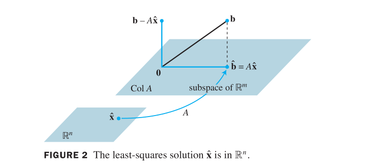

---
output:
  md_document:
    variant: markdown_github
    md_extensions: +tex_math_dollars
    pandoc_args: ['--webtex']
    toc: true
    toc_depth: 2
---

```{r include=FALSE}
library(knitr)
opts_chunk$set(fig.path='img/',
               fig.width=1080/120,
               fig.height=1080/120,
               dpi=120, fig.retina=2)
```

<h1>Advanced Linear Models III</h1>

- Keith Hughitt
- March 06, 2017

Overview
========

This week will be a brief digression from the current series of notes which
follow the Advanced Linear Models Coursera course.

Instead, this week I will review the basic of linear models as they are
introduced from a couple different sources:

1. A linear algebra textbook (Lay)
2. A GLM textbook (Dobson & Barnett)

Interestingly, in the Lay formulation of the least-squares solution, we are
able to arrive at the familiar expression for the solution using only the tools
of basic linear algebra (i.e. no differentiation.)

Lay 6.5
=======

## 6.5 Least-squares problems

### Overview

- When a sytem represented by $Ax = b$ has no solution, it is _inconsistent_
- In this case, the best you can do is find an $x$ that makes $Ax$ as close to
  $b$ as possible.
- The **general least-squares problem** is to find an $x$ that makes $||b - Ax||$
  as small as possible.
- _No matter what x we select, the vector Ax will necessarily be in the column
  space, ColA_.
- So the solution, $x$ is the vector which makes $Ax$ the closest point in
  Col$A$ to $b$.

### Solution of the General Least-Squares Problem

**Best Approximation Theorem** (Lay 6.3)

Let $W$ be a subspace of $ℝ^n$, $y$ any vector in $ℝ^n$, and $\hat{y}$ the
orthogonal projection of $y$ onto $W$. Then $\hat{y}$ is the closest point in
$W$ to $y$ in the sense that:

$$
||y - \hat{y}|| < ||y - v||
$$

for all $v$ in $W$ from $\hat{y}$.

We can use this theorem to find the closest point in Col$A$ to $b$.

Let:

$$
\hat{b} = \text{proj}_{ColA} b
$$

Recall, from Lay 6.2, an **orthogonal projection** is defined as:

$$
\hat{y}{  = \text{proj}_L y = \frac{y \cdot u}{u \cdot u} u
$$

Because $\hat{b}$ is in the column space of $A$, we know that $Ax = \hat{b}$ is
consistent and there is an $\hat{x}$ in $ℝ^n$ such that:

$$
A\hat{x} = \hat{b}
$$

Since $\hat{b}$ is the closest point in ColA to $b$, the vector $\hat{x}$ is 
a least-squares solution of $Ax = b$.

### Finding $\hat{x}$

Going back to the definition of orthogonal projections, we have:

**Orthogonal Decomposition Theorem** (Lay 6.3)

Let $W$ be a subspace of $ℝ^n$. Then each $y$ in $ℝ^n$ can be written uniquely
in the form:

$$
y = \hat{y} + z
$$

Where $\hat{y}$ is in $W$ and $z$ in in $W^\perp$. In fact, if
$\{u_1,...,u_p\}$ is any orthogonal basis of $W$, then:

$$
\hat{y} = \frac{y \cdot u_1}{u_1 \cdot u_1} u_1 + ... + \frac{y \cdot u_p}{u_p \cdot u_p} u_p
$$

and $z = y - \hat{y}$

- The vector $\hat{y}$ is called the **orthogonal projection of y onto W**, and
  often is written as $\text{proj}_W y$.
- _See Lay 6.2 on orthogonal sets and bases_



By ODT, the projection $\hat{b}$ has the property that $b - \hat{b}$ is
orthogonal to $ColA$, so $b - A\hat{x}$ is orthogonal to each column of A.

If $a_j$ is any column of A, then $a_j \cdot (b-A\hat{x}) = 0$, and 
$a_j^T(b - A\hat{x}) = 0$. Since each $a_j^T$ is a row of $A^T$:

$$
A^T(b - A\hat{x}) = 0
$$

Thus:

$$
A^Tb - A^TA\hat{x} = 0
$$

$$
A^TA\hat{x} = A^Tb
$$

So the least-squares solution of $Ax = b$ satisfies the equation:

$$
A^TAx = A^Tb
$$.

(Work through example 1...)

**Theorem 14**

The matrix $A^TA$ is invertible _if and only if_ the columns of $A$ are
linearly independent. In this case, the equation $Ax = b$ has only one
least-squares solution, $\hat{x}$, and it is given by:

$$
\hat{x} = (A^TA)^{-1}A^Tb
$$


Dobson & Barnett Chapter 6: Normal Linear Models
================================================

In this text, models of the form:

$$
\text{E}(Y_i) = \mu_i = \textbf{x}_i^T \beta; Y_i \sim \text{N}(\mu_i, \sigma^2)
$$

Where:

- $Y_1,...,Y_N$ are independent random variables
- The link function is the identity function, $g(\mu_i) = \mu_i$

This model is often written as:

$$
\textbf{y} = \textbf{X} \beta + \textbf{e}
$$

Where the $e_i$'s are IID random variables with $e_i \sim \textbf{N}(0, \sigma^2)$

Models of this form are called **general linear models** and include:

- multiple linear regression
- ANOVA
- ANCOVA

(Text goes on to show that for these models, maximum likelihood estimators and
least squares estimators are the same..)


References
==========

1. Lay Chapters 6.5
2. Dobson, A. J., & Barnett, A. (2008). An introduction to generalized linear
   models. CRC press. (Chapter 6)

