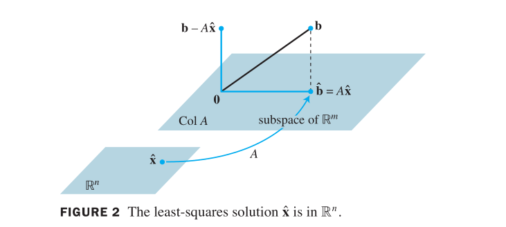

-   [Overview](#overview)
-   [Lay 6.5](#lay-6.5)
    -   [6.5 Least-squares problems](#least-squares-problems)
-   [Dobson & Barnett Chapter 6: Normal Linear Models](#dobson-barnett-chapter-6-normal-linear-models)
-   [References](#references)

<h1>
Advanced Linear Models III
</h1>
-   Keith Hughitt
-   March 06, 2017

Overview
========

This week will be a brief digression from the current series of notes which follow the Advanced Linear Models Coursera course.

Instead, this week I will review the basic of linear models as they are introduced from a couple different sources:

1.  A linear algebra textbook (Lay)
2.  A GLM textbook (Dobson & Barnett)

Interestingly, in the Lay formulation of the least-squares solution, we are able to arrive at the familiar expression for the solution using only the tools of basic linear algebra (i.e. no differentiation.)

Lay 6.5
=======

6.5 Least-squares problems
--------------------------

### Overview

-   When a sytem represented by  has no solution, it is *inconsistent*
-   In this case, the best you can do is find an  that makes  as close to  as possible.
-   The **general least-squares problem** is to find an  that makes  as small as possible.
-   *No matter what x we select, the vector Ax will necessarily be in the column space, ColA*.
-   So the solution,  is the vector which makes  the closest point in Col to .

### Solution of the General Least-Squares Problem

**Best Approximation Theorem** (Lay 6.3)

Let  be a subspace of ,  any vector in , and  the orthogonal projection of  onto . Then  is the closest point in  to  in the sense that:

for all  in  from .

We can use this theorem to find the closest point in Col to .

Let:

Recall, from Lay 6.2, an **orthogonal projection** is defined as:

Because  is in the column space of , we know that  is consistent and there is an  in  such that:

Since  is the closest point in ColA to , the vector  is a least-squares solution of .

### Finding 

Going back to the definition of orthogonal projections, we have:

**Orthogonal Decomposition Theorem** (Lay 6.3)

Let  be a subspace of . Then each  in  can be written uniquely in the form:

Where  is in  and  in in . In fact, if  is any orthogonal basis of , then:

and 

-   The vector  is called the **orthogonal projection of y onto W**, and often is written as .
-   *See Lay 6.2 on orthogonal sets and bases*

By ODT, the projection  has the property that  is orthogonal to , so  is orthogonal to each column of A.

If  is any column of A, then  = 0"), and  = 0"). Since each  is a row of :

 = 0
")

Thus:

So the least-squares solution of  satisfies the equation:

.

(Work through example 1...)

**Theorem 14**

The matrix  is invertible *if and only if* the columns of  are linearly independent. In this case, the equation  has only one least-squares solution, , and it is given by:

^{-1}A^Tb
")

Dobson & Barnett Chapter 6: Normal Linear Models
================================================

In this text, models of the form:

 = \mu_i = \textbf{x}_i^T \beta; Y_i \sim \text{N}(\mu_i, \sigma^2)
")

Where:

-    are independent random variables
-   The link function is the identity function,  = \mu_i")

This model is often written as:

Where the 's are IID random variables with ")

Models of this form are called **general linear models** and include:

-   multiple linear regression
-   ANOVA
-   ANCOVA

(Text goes on to show that for these models, maximum likelihood estimators and least squares estimators are the same..)

References
==========

1.  Lay Chapters 6.5
2.  Dobson, A. J., & Barnett, A. (2008). An introduction to generalized linear models. CRC press. (Chapter 6)
