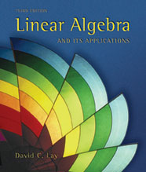
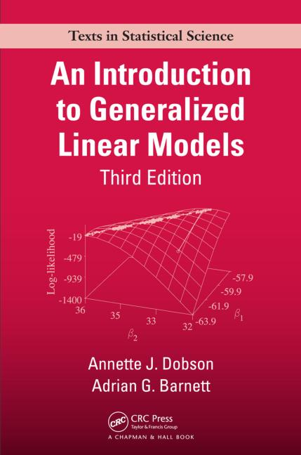

Study Group: Linear models and GLMs
===================================

## Overview

This repository contains the notes for a study group held at the University of
Maryland, College Park from June 2016 - ...

The purpose of the study group is to obtain a rigorous understanding of the
basics of linear modeling, and eventually other types of related models such as
generalized linear models (GLMs).

To achieve this, we first plan to spend some time reviewing basic concepts from
linear algebra, statistics, and multivariate calculus.

For the linear algebra review, we have decided to use the 3rd edition of the 
Lay undergraduate textbook, [Linear Algebra and its
Applications](http://www.laylinalgebra.com/).

To review standard linear models we worked through the "Advanced Linear Models for Data Science 1: Least Squares" Coursera course, https://www.coursera.org/learn/linear-models/home/welcome.   

We used the following textbook, "An Introduction to Generalized Linear Models, Third Edition" by Annette J. Dobson, Adrian Barnett to cover generalized linear models. An Introduction to Generalized Linear Models, Third Edition
Annette J. Dobson, Annette J. Dobson, to cover generlized linear models.   

  

## Reading list

Some possible topics and papers for discussion:

--  

- [x] Devarajan,K. (2008) Nonnegative matrix factorization: An analytical and interpretive tool in computational biology. PLoS Comput. Biol., 4.
- [ ] Meng,C., Zeleznik,O.A., Thallinger,G.G., Kuster,B., Gholami,A.M. and Culhane,A.C. (2016) Dimension reduction techniques for the integrative analysis of multi-omics data. Brief. Bioinform., 17, bbv108.
- [ ] Witten,D.M., Tibshirani,R. and Hastie,T. (2009) A penalized matrix decomposition, with applications to sparse principal components and canonical correlation analysis. Biostatistics, 10, 515–534.
- [ ] https://en.wikipedia.org/wiki/Quantile_regression
- [ ] [varimax rotations](http://www.theanalysisfactor.com/rotations-factor-analysis/) (PCA/FA)
